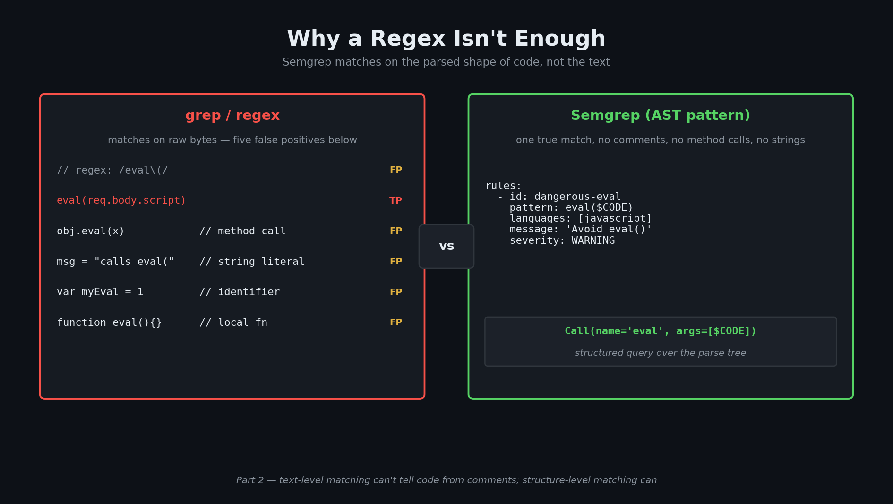

# Pattern Matching at Scale: Why a Regex Isn't Enough

> Part 2 of 8. Why static pattern matchers exist, what they actually do, and where the technique stops working.

---

Here's a question I find myself asking whenever someone shows me a "security scanner": what's it actually looking at?

Because there's a massive gap between a tool that can *grep for dangerous function names* and a tool that can *understand the shape of the code around them*. The first one produces a wall of noise so thick that engineers learn to ignore it. The second one is genuinely useful — cheap to run, catches real bugs, and earns the trust of the people who have to act on its output.

In this post, I want to explain why that gap exists, how modern pattern matchers bridge it, and — honestly — where even the best pattern matcher eventually hits a wall. Because understanding that wall is exactly what motivates the next post (dataflow analysis), which is where the really interesting stuff starts.

---

## Series navigation

- Understanding AI-Native Security (Part 1): What this all actually means — and a vocabulary primer (done!)
- **📌 Understanding AI-Native Security (Part 2): Pattern Matching at Scale — Why a regex isn't enough (this blog post!)**
- Understanding AI-Native Security (Part 3): Dataflow Analysis — When pattern matching isn't enough (coming soon!)
- Understanding AI-Native Security (Part 4): SMT Solvers and the Math of Killing False Positives (coming soon!)
- Understanding AI-Native Security (Part 5): Fuzzing, and Where RAPTOR Enters the Story (coming soon!)
- Understanding AI-Native Security (Part 6): Binary Exploit Feasibility — From crash to constraints (coming soon!)
- Understanding AI-Native Security (Part 7): The LLM Validation Pipeline (coming soon!)
- Understanding AI-Native Security (Part 8): Putting It All Together — Honestly (coming soon!)

---

## In this post

- Why regex-based "scanning" is too imprecise to be useful in practice
- What an abstract syntax tree (AST) is, and why it changes everything for pattern matching
- How a Semgrep rule actually looks and what it can express
- The categories of bug where pattern matching genuinely dominates
- What SARIF is and why it's the glue that makes multi-scanner pipelines work
- Where pattern matching shines — and where it simply cannot help

---

## Why pattern matching is the first line of defence

The single most common security bug class — across every language, framework, and era — is *using a dangerous API in a way that's easy to detect from looking at one line of code*. `MD5` used for password hashing. `eval()` called on user input. `shell=True` passed to a subprocess. `pickle.loads` on data from the network. A hardcoded `API_KEY = "sk-..."` sitting in a config file.

These don't require sophisticated reasoning to find. They require a tool that can read source code, recognise syntactic shapes, and flag the matches. And because they're so common, the cost-benefit of finding them automatically is overwhelmingly in your favour.

**Pattern matchers exist because grepping is too imprecise and writing AST visitors by hand is too expensive.**

[Semgrep](https://semgrep.dev/docs/) is the most widely-used open-source tool in this space, so I'll use it as the running example throughout this post. The concepts apply equally to its commercial cousins (CodeChecker, SonarQube, Checkmarx) and to specialised tools (Bandit for Python, ESLint security plugins for JavaScript).

---

## What grep gets wrong

Suppose you want to find every call to `eval()` in a JavaScript project. A regex like `eval\(` matches the call. It also matches:

- The string `"eval("` inside a comment
- A property access like `obj.eval(...)` (which is a different `eval`)
- A function *named* `eval` defined locally that happens to be safe
- A variable named `myEval` declared somewhere

Each of those false positives is annoying on its own. Multiply by every dangerous-function pattern your team cares about, multiply again by every file in your repository, and you get a wall of noise that nobody reads. The team stops trusting the tool; the bugs ship anyway.

The fix isn't a smarter regex. The fix is to look at the *abstract syntax tree* — the structured representation of the code that the parser produces — and write patterns over that. The AST already knows that `obj.eval(x)` is a method call on `obj`, not a call to a top-level identifier called `eval`. It already knows that text inside a comment isn't code. The pattern matcher just has to consume the AST and check shapes against it.

This is what Semgrep does. **Why this technique exists:** because regex can't see structure, and seeing structure is exactly what you need to make security pattern matching usable in practice.

---

## The shape of a pattern matcher's rule

A Semgrep rule looks like this:

```yaml
rules:
  - id: dangerous-eval
    pattern: eval($CODE)
    message: "Avoid eval(); it executes arbitrary code"
    languages: [javascript]
    severity: WARNING
```

`$CODE` is a *metavariable* — it matches anything in that position. So this rule fires on `eval(userInput)`, `eval("1+1")`, and `eval(req.body.script)`. It does *not* fire on `safeEval(x)` or `obj.eval(x)`.

You can compose patterns. Want to find `eval` only when the argument comes from `req.body`? Add a `pattern-inside` clause with a metavariable constraint. Want to ignore cases that pass through a sanitiser? Add a `pattern-not`. The full pattern syntax is essentially a typed query language over ASTs.

This is what makes the technique tractable for security. You're not writing one giant regex; you're composing small, language-aware predicates that match exactly the bug shape you care about.

---

## The categories where pattern matching wins

The most valuable pattern-matching rules fall into a few categories. Every team that maintains a security ruleset converges on something like this list.

**Cryptographic misuse.** Probably the highest ROI category of all. A single-line rule catching `hashlib.md5()` used for password storage finds bugs that would otherwise sit in production for years. Crypto misuse is almost always structurally detectable:

- `MD5`, `SHA1` used where you need a password hash
- `DES`, `RC4`, `3DES` ciphers
- ECB block mode (the famous Tux penguin image is what ECB does to your data — look it up if you haven't)
- Static IVs or nonces passed to AES-GCM (a single repeated nonce is catastrophic for GCM)
- `Math.random()` or `random.random()` used for tokens or session IDs
- RSA key sizes below 2048 bits
- Missing or weak KDFs (raw hashes instead of `bcrypt` / `scrypt` / `argon2` / `PBKDF2`)

Each of these is one line in a YAML rule. The asymmetry — one cheap rule, one common-but-devastating bug class caught — is why pattern matching earns its place as the first responder in any pipeline.

**Hardcoded secrets.** String literals named `PASSWORD`, `API_KEY`, etc., or matching the shape of common API key formats (Stripe keys start with `sk_`, AWS keys with `AKIA`, etc.). Trivial to detect, embarrassingly common to find.

**Dangerous API usage.** `eval`, `pickle.loads` on untrusted input, `subprocess` with `shell=True` and f-strings, deserialisation of untrusted formats. The bug is in the *combination* of API + input source, both visible at the call site.

**Misconfiguration.** YAML/JSON files declaring permissive S3 ACLs, disabled TLS verification, public Kubernetes services. The configuration *is* the bug; nothing to dataflow about.

**Path traversal entry points.** File operations whose path argument comes directly from a request parameter without normalisation or allowlist checking.

A reasonable starting ruleset across all of these is around 30–50 rules. You add more as you encounter team-specific patterns worth tracking.

---

## SARIF: the output format that makes pipelines composable

A pattern matcher's output isn't useful on its own — it's useful when it feeds the next stage of a pipeline. The lingua franca for that handoff is [SARIF 2.1.0](https://docs.oasis-open.org/sarif/sarif/v2.1.0/sarif-v2.1.0.html), an OASIS-standard JSON format for static analysis results.

A SARIF file describes:

- **Tool metadata** — what scanner produced this, what version, with what rules enabled
- **Results** — each finding as a structured object with location, rule ID, severity, message, and (optionally) CWE tags
- **Code flows** — for dataflow-based findings, the sequence of locations from source to sink

The reason SARIF matters: you can run multiple scanners — Semgrep plus a dataflow tool plus an SCA tool — get multiple SARIF files, and merge them into a single deduplicated view. Without a common format, every tool integration is a custom parsing project. With SARIF, the integration is plumbing.

A merge layer typically does four things:

1. **Concatenate results** from all sources into a single inventory
2. **Infer CWE tags** where they're missing — many rules don't tag themselves, but the rule ID often implies the CWE
3. **Normalise finding metadata** into a canonical schema
4. **Deduplicate** — when two tools fire on the same line for the same CWE, you get one finding, not two

By the time the merged output leaves the static-analysis layer, you have a clean inventory of distinct vulnerabilities ready for whatever validation or triage step comes next.

---

## Where pattern matching shines and where it stops

**Best at:**
- **Cryptographic misuse.** Almost always a structural pattern.
- **Hardcoded secrets.** String literals with revealing names.
- **Dangerous API usage.** `eval`, `pickle.loads`, `shell=True` with formatted strings.
- **Misconfiguration.** Declarative configs are inherently pattern-shaped.

**Weakest at:**
- **Anything that requires understanding data flow across function boundaries.** Pure pattern matching is intra-procedural by design. If `getUserInput()` returns tainted data and you pass it through three helper functions before reaching `subprocess.run`, the pattern matcher won't connect the dots. **This is why dataflow analysis exists** — and is the entire subject of the next post.
- **Logic bugs.** A pattern like "this authorisation check should be present but isn't" requires reasoning about *absence*, which is hard to express as a pattern.
- **Runtime-dependent issues.** Race conditions, TOCTOU, memory safety in C — these need fuzzing or runtime instrumentation. We'll get to fuzzing in Post 5.

This pattern of *technique X works because Y, but stops working at Z, which is why we need technique W* is going to recur through the series. No single tool covers the whole attack surface. The art is composing them so the gaps line up.

---

## For the AI/ML engineers reading this

A few notes on why pattern matching is the right first stage in any pipeline that eventually ends with LLM analysis:

- **Speed.** A scan completes in seconds. You can put it in the inner loop — every commit, every PR. The LLM stages don't run on every commit; the cheap stage does.
- **High precision when the pattern is specific.** Crypto rules and hardcoded-secret rules have near-zero false positive rates. The LLM doesn't need to do much validation work on these — confirm in two sentences and move on.
- **High recall when the pattern is general.** Broad rules ("user input flowing into SQL execute") have higher false-positive rates. This is where downstream LLM validation matters — you'd rather have the rule fire too often and let the LLM cull, than have it miss real bugs.
- **Structured output you can feed to a model.** SARIF includes file path, line number, rule ID, surrounding code snippet, and CWE. That's exactly the structured context an LLM needs to reason about a finding without re-reading the entire codebase.

The pipeline assumption is that *cheap pattern matching plus targeted LLM validation has better economics than either tool alone*. The pattern matcher is the candidate generator; the LLM is the judge. We'll see in Post 7 what good judging looks like.


*Figure 1 — Candidate generator + judge. The asymmetry is the point: the cheap stage runs on every commit and produces orders of magnitude more candidates than the expensive stage can examine, but the expensive stage only ever sees real candidates rather than the whole codebase.*

---

## Next in series

- [Post 3 — Dataflow Analysis](./03-codeql-dataflow-analysis.md). Where pattern matching ends, dataflow begins.

## Sources and further reading
- *[Semgrep documentation](https://semgrep.dev/docs/) — the canonical reference for pattern syntax*
- *[OASIS SARIF 2.1.0 specification](https://docs.oasis-open.org/sarif/sarif/v2.1.0/sarif-v2.1.0.html) — the interchange format*
- *[Semgrep Registry](https://semgrep.dev/explore) — community-maintained rule packs to learn from*
- *Bessey et al., ["A Few Billion Lines of Code Later"](https://cacm.acm.org/research/a-few-billion-lines-of-code-later/) — Communications of the ACM, 2010. The Coverity team's classic essay on what it takes to make a static analyser useful in practice; still the best short read on the false-positive economics that any pattern matcher has to manage.*
