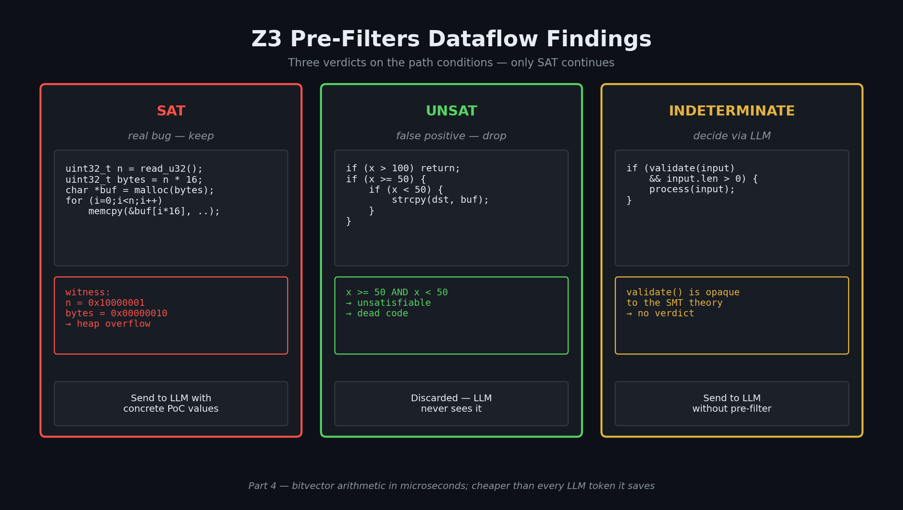

# SMT Solvers and the Math of Killing False Positives

> Part 4 of 8. Why constraint solvers exist, what they actually do, and how using one in front of an LLM pipeline saves analysts hours per scan.

---

Let me start with a puzzle. Not a security puzzle — an actual puzzle.

You've got a Sudoku grid in front of you. 81 cells, 30 of them already filled in. The rules: each row, each column, and each 3×3 box must contain the digits 1–9 with no repeats. Your job is to find values for the remaining 51 empty cells.

What you're doing — formally — is *constraint satisfaction*. You have a set of variables (the empty cells), each with a finite domain (1–9), and a set of constraints (the row/column/box rules). You're looking for an assignment that satisfies all constraints simultaneously. If you find one, the puzzle is *satisfiable* (SAT). If you can prove no assignment exists — say, two of the pre-filled cells already contradict each other — the puzzle is *unsatisfiable* (UNSAT).

Here's the thing: every security pipeline has a Sudoku problem hiding inside it.

---

## Series navigation

- Understanding AI-Native Security (Part 1): What this all actually means — and a vocabulary primer (done!)
- Understanding AI-Native Security (Part 2): Pattern Matching at Scale — Why a regex isn't enough (done!)
- Understanding AI-Native Security (Part 3): Dataflow Analysis — When pattern matching isn't enough (done!)
- **📌 Understanding AI-Native Security (Part 4): SMT Solvers and the Math of Killing False Positives (this blog post!)**
- Understanding AI-Native Security (Part 5): Fuzzing, and Where RAPTOR Enters the Story (coming soon!)
- Understanding AI-Native Security (Part 6): Binary Exploit Feasibility — From crash to constraints (coming soon!)
- Understanding AI-Native Security (Part 7): The LLM Validation Pipeline (coming soon!)
- Understanding AI-Native Security (Part 8): Putting It All Together — Honestly (coming soon!)

---

## In this post

- What SMT solvers are and why they exist
- Why a security pipeline cares about constraint solving
- Bitvector arithmetic — how SMT solvers model C semantics exactly
- Three groups of real cases: SAT (bugs found), UNSAT (false positives killed), and Indeterminate (graceful fallback)
- A worked decision matrix showing the full economics
- The engineering pattern that generalises way beyond security

---

## What SMT solvers actually do

An [SMT solver](https://en.wikipedia.org/wiki/Satisfiability_modulo_theories) does the same thing as our Sudoku solver, but for arbitrary logical formulas over arbitrary mathematical *theories*: integer arithmetic, bitvectors, arrays, real numbers, strings. Give it a formula, and it tells you SAT (with a witness assignment that satisfies it) or UNSAT (with a proof that no assignment can exist).

**Why SMT solvers exist:** because a huge class of real-world questions — "is this program path reachable?", "is this hardware design correct?", "is this scheduling problem feasible?" — reduces to constraint satisfaction. Once you have a general-purpose constraint solver, every such question can be answered mechanically.

[Z3](https://github.com/Z3Prover/z3), developed at Microsoft Research by Leonardo de Moura and Nikolaj Bjørner ([TACAS 2008 paper](https://www.microsoft.com/en-us/research/publication/z3-an-efficient-smt-solver/)), is the most widely deployed SMT solver in the world. It's MIT-licensed, has bindings in every major language, and is the de-facto choice for program verification, symbolic execution, and security analysis.

---

## Why a security pipeline cares about SMT

Recall from Post 3 that a dataflow analyser outputs a structured path: source → through some intermediate nodes → to a sink. Along the way, the path may pass through one or more conditional branches. Each branch imposes a *path condition* on the variables.

Now ask the question: *for this path to actually be executable, do there exist input values that satisfy all the path conditions simultaneously?*

If the answer is no — the conditions are mutually contradictory — then the path is **dead code**. The dataflow tool flagged it (correctly, as a syntactic dataflow), but it can never execute in practice. The finding is a false positive.

If the answer is yes, then not only is the path reachable, but the solver hands you specific input values that reach it. **Those values are a candidate proof-of-concept.**

Either way, you've extracted enormous value before any expensive analysis stage runs. UNSAT means *don't waste the analyst's time*. SAT means *here's the input, the analyst's job is much easier*.

This is the engineering trick. **Cheap deterministic solver in front; expensive probabilistic reasoner (human or LLM) behind.** It's one of the cleanest examples in applied AI of using a classical tool to make an LLM tool faster and more reliable.

---

## Bitvector arithmetic: matching C semantics

When we encode C code in Z3, we don't use mathematical integers — we use **bitvectors**. A 32-bit unsigned integer in C is not the abstract integer 4,294,967,295; it's a 32-bit pattern that overflows back to 0 when incremented. SMT solvers have a dedicated theory for this, [QF_BV](https://smt-lib.org/logics-all.shtml#QF_BV) — quantifier-free bitvector logic — that models the wrap-around behaviour exactly.

This matters because the most interesting bug class in C (integer overflow leading to memory corruption) only exists *because* of wraparound. If we encoded C's `unsigned int` as a mathematical integer, the bug would disappear from the model. Bitvector logic preserves the bug — which is exactly what we want.

Z3 supports QF_BV natively. The next sections walk through what happens when you encode real C path conditions in this theory.

---

## Three groups of cases worth walking through

To make the SAT/UNSAT story concrete, here are eight C cases drawn from a purpose-built test corpus designed to exercise every interaction between a dataflow tool, an SMT solver, and a downstream analyst. They fall into three groups:

1. **SAT** — real bugs the solver finds and hands the analyst a PoC for
2. **UNSAT** — false positives the solver kills before anyone wastes time
3. **Indeterminate** — cases the solver can't reason about, which fall through to full manual or LLM analysis

### Group 1: SAT — the bugs the solver finds for you

**Case 1a: integer overflow → heap overflow (CWE-190 → CWE-122)**

```c
#define MAX_RECORDS  0x40000000u  // 1 billion
#define MAX_ALLOC    0x8000u      // 32 KB
#define RECORD_SIZE  16u

void case_alloc_overflow(unsigned int count) {
    unsigned int alloc_size = count * RECORD_SIZE;   // 32-bit multiply, wraps

    if (count >= MAX_RECORDS) { return; }    // looks protective
    if (alloc_size >= MAX_ALLOC) { return; } // looks protective

    record_t *records = malloc(alloc_size);
    for (unsigned int i = 0; i < count; i++) {
        memset(&records[i], 'A', RECORD_SIZE);  // writes count*16 bytes into alloc_size buffer
    }
}
```

The function looks safe. Two guards bound `count` and `alloc_size`. The trap is that `alloc_size = count * RECORD_SIZE` is computed in 32-bit unsigned arithmetic *before* the guards run. If `count * 16` wraps, `alloc_size` can be a small value that passes the guard while `count` is enormous.

The solver encodes:
```
count < 0x40000000             ; MAX_RECORDS guard (negated)
alloc_size < 0x8000            ; MAX_ALLOC guard (negated)
alloc_size == count * 16       ; bitvector multiply, wraps
```

Z3 returns SAT with **`count = 0x10000001`** (268,435,457). Verify: `0x10000001 × 16 = 0x100000010`. Truncated to 32 bits: `0x10` (16 bytes). Both guards pass. `malloc(16)` allocates 16 bytes. The loop then writes `0x10000001 × 16 ≈ 4 GB` into that 16-byte buffer.

That `count = 268435457` value can be injected directly into whatever analyst process runs next — a human reviewer, an LLM prompt, a fuzzer's seed input. The downstream analyst doesn't have to figure out the overflow arithmetic — the solver already proved it. Their job is now to reason about exploitability and impact.

**Case 1b: unsigned sum overflow — bounds check bypass (CWE-190 → CWE-120)**

```c
if (offset + length <= buffer_size) {           // unsigned wraparound bypass
    memcpy(shared_buffer + offset, src, length); // OOB write
}
```

`offset + length` wraps. Z3 finds `offset = 0xFFFF0000`, `length = 0x00010010` → sum = `0x10` ≤ 64 ✓. `memcpy` then writes 65,552 bytes starting 4 GB past the buffer. The signed/unsigned-confusion class of bug, captured deterministically.

**Case 1c: off-by-one — `<=` where `<` was meant (CWE-193)**

```c
if (index > INDEX_LIMIT) { return; }   // bug: should be >=
buf[index] = value;                    // OOB when index == 128
```

The guard uses `>` instead of `>=`, so `index == 128` reaches the write. Z3 trivially finds `index = 128`. The kind of bug humans miss on a tired afternoon — the solver finds it in microseconds.

### Group 2: UNSAT — the false positives the solver kills

These three cases are dataflow paths a tool correctly identifies as syntactically valid source-to-sink flows, but whose path conditions are mathematically impossible.

**Case 2a: value range contradiction**

```c
if (x <= 100) { return; }   // x > 100 past here
if (x >= 50) {              // always true
    if (x < 50) {           // x > 100 AND x < 50 — impossible
        strcpy(dead_buf, data);
    }
}
```

Z3 encodes `x > 100 ∧ x < 50`, returns UNSAT. Finding discarded.

**Case 2b: pointer nullness contradiction**

```c
if (ptr == NULL) { return; }  // ptr is non-null past here
if (ptr != NULL) {
    strncpy(dst, ptr, 32);    // safe path
} else {
    strcpy(dst, ptr);         // ptr != NULL ∧ ptr == NULL — impossible
}
```

UNSAT in microseconds. Discarded.

**Case 2c: bitmask contradiction**

```c
if (flags & 0x1) { return; }    // bit 0 is 0 past here
if ((flags & 0x1) == 1) {       // bit 0 is 1 — impossible
    ...
}
```

A single bit can't be both 0 and 1. UNSAT. Discarded.

**The economics of these three cases**: without the solver, each would be a full review ending in "false positive — branches are mutually exclusive." With the solver, each is gone in microseconds, never reaches an LLM or human, and never appears in the operator's report. Across a large codebase this is the difference between a clean inventory and a noisy pile.

### Group 3: indeterminate — graceful degradation

Some path conditions can't be encoded in bitvector arithmetic. Function calls are the most common reason — the solver can't reason about `strlen(input)` or `validate(ptr)` without knowing what those functions do.

**Case 3a: function call in condition**

```c
if (strlen(input) < sizeof(local)) {
    strcpy(local, input);
}
```

The solver's parser sees `strlen(input)` and gives up. Returns `feasible=None`. The framework treats this as "we couldn't pre-screen this one" and full analysis runs unchanged.

**Case 3b: partial parse, mixed conditions**

```c
if (size >= sizeof(buf)) { return; }    // parseable: size < 256
if (validate(ptr)) {                    // unparseable
    memcpy(buf, ptr, size);
}
```

One condition parses, one doesn't. Solver returns `feasible=None`. Full analysis runs.

The key design choice: **indeterminate is never treated as UNSAT**. The framework is conservative — when the solver doesn't know, the LLM/analyst still gets a chance. The cost is one analysis call per indeterminate case; the alternative would be silently dropping potentially-real findings, which is the failure mode you really want to avoid.

---

## The decision matrix in practice

| Finding type | Solver result | Action |
|---|---|---|
| Case 1a (alloc overflow) | SAT — `count = 0x10000001` | PoC injected into analyst's input; full review runs |
| Case 1b (sum overflow) | SAT — `offset = 0xFFFF0000, length = 0x10010` | PoC injected; full review |
| Case 1c (off-by-one) | SAT — `index = 128` | PoC injected; full review |
| Case 2a (range) | UNSAT | Discarded |
| Case 2b (nullness) | UNSAT | Discarded |
| Case 2c (bitmask) | UNSAT | Discarded |
| Case 3a (`strlen` call) | None (unparseable) | Full review runs |
| Case 3b (`validate` call) | None (partial parse) | Full review runs |


*Figure 1 — The three-way decision visualised. SAT pulls the witness values into the LLM prompt as a free PoC; UNSAT kills the finding before any expensive analysis runs; indeterminate gracefully degrades to full LLM review with a warning. The framework never silently drops a finding it couldn't reason about.*

The empirical sweet spot for SMT pre-screening is **CWE-190 (integer overflow), CWE-120 / CWE-122 (buffer overflows), CWE-193 (off-by-one), and CWE-476 (null pointer dereference)**. These are exactly the CWEs whose preconditions reduce naturally to bitvector or pointer-nullness constraints.

For higher-level CWEs (logic flaws, authorisation bypasses, XSS), SMT pre-screening doesn't help — the constraints aren't expressible in QF_BV without modelling the entire surrounding world. That's where LLMs or human reviewers earn their keep.

---

## Why this matters as a pattern beyond security

If you're an AI/ML engineer, the lesson generalises cleanly:

- **Identify the cheap-deterministic / expensive-probabilistic boundary.** SMT solvers are cheap and deterministic; LLMs are expensive and probabilistic. A few milliseconds in the solver avoids dollars and seconds in LLM calls.
- **Let the cheap stage produce input for the expensive stage.** SMT doesn't just gatekeep; it produces concrete witness values when satisfiability holds. Those values make the LLM's job easier — fewer reasoning steps, smaller chance of hallucination.
- **Make degradation explicit.** When the solver can't reason about a constraint, the pipeline shouldn't lie about it. `feasible=None` is a first-class result, plumbed through the rest of the system, visible to the operator.
- **Treat false positives as engineering work, not noise.** Every false-positive class is a place to deploy a specific filter. Pattern-condition contradictions get SMT. Test-only code gets a static check. Sanitised inputs get a dedicated disqualifier. Each filter is a deliberate engineering choice with measurable impact.

The general principle: **anywhere your LLM is doing something a deterministic solver could do, replace it.** The LLM is for the parts where there is no solver — judgement, prose generation, weighing competing considerations.

---

## Next in series

- [Post 5 — AFL++: Coverage-Guided Fuzzing](./05-afl-coverage-guided-fuzzing.md). The next post is also where we introduce the open-source framework that wires together everything we've covered.

## Sources and further reading
- *de Moura & Bjørner, ["Z3: An Efficient SMT Solver"](https://www.microsoft.com/en-us/research/publication/z3-an-efficient-smt-solver/) — TACAS 2008. The original paper; still the clearest short explanation of how Z3 combines theory solvers.*
- *[Z3 GitHub repository](https://github.com/Z3Prover/z3) — implementation, language bindings, and a tutorial in the wiki.*
- *Cadar & Sen, ["Symbolic Execution for Software Testing"](https://cacm.acm.org/research/symbolic-execution-for-software-testing-three-decades-later/) — Communications of the ACM, 2013. The best survey of how SMT solvers connect to program analysis, written by two of the people who pushed it forward.*
- *[SMT-LIB](https://smt-lib.org/) — the standard input format and theory specifications.*
