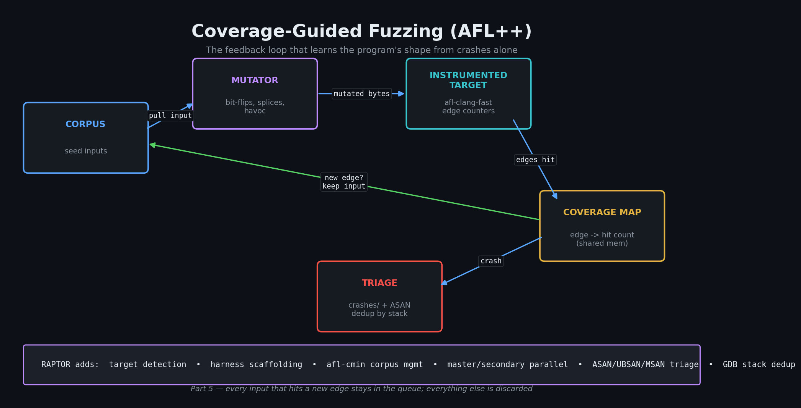

# Fuzzing, and Where RAPTOR Enters the Story

> Part 5 of 8. Why fuzzing exists, why static analysis can never replace it, and — for the first time in this series — a look at a specific open-source framework that wires together everything we've covered so far.

---

This week I want to tell you about the moment I realized that all the smart code analysis in the world has a hard ceiling — and that ceiling isn't a failure of intelligence. It's a fundamental limit of reasoning about things without actually doing them.

I was staring at a CodeQL output for a compiled binary. The dataflow path was beautiful: tainted bytes flowing from a socket read, through three helper functions, all the way to a `memcpy` with a length field I controlled. The SMT solver had checked the path constraints and come back SAT. Every light was green. And yet I could not tell you with confidence whether, given this particular allocator state, this particular glibc version, this particular register layout, a carefully crafted 47-byte packet would actually crash the program. There was only one way to find out: actually run the program.

That's the moment fuzzing stops being a curiosity and starts being essential. And it's the perfect place to bring in the first concrete framework we're discussing in this series.

---

## Series navigation

- Understanding AI-Native Security (Part 1): What this all actually means — and a vocabulary primer (done!)
- Understanding AI-Native Security (Part 2): Pattern Matching at Scale — Why a regex isn't enough (done!)
- Understanding AI-Native Security (Part 3): Dataflow Analysis — When pattern matching isn't enough (done!)
- Understanding AI-Native Security (Part 4): SMT Solvers and the Math of Killing False Positives (done!)
- **📌 Understanding AI-Native Security (Part 5): Fuzzing, and Where RAPTOR Enters the Story (this blog post!)**
- Understanding AI-Native Security (Part 6): Binary Exploit Feasibility — From crash to constraints (coming soon!)
- Understanding AI-Native Security (Part 7): The LLM Validation Pipeline (coming soon!)
- Understanding AI-Native Security (Part 8): Putting It All Together — Honestly (coming soon!)

---

## In this post

- The fundamental wall that every static technique — pattern matching, dataflow analysis, SMT solving — hits, and why it's a wall, not a speed bump
- The breakthrough that made fuzzing tractable at scale: coverage-guided mutation
- How AFL++ actually works, in three parts: instrumentation, mutation, triage
- Where RAPTOR enters the picture — the first time in this series we look at a specific framework that wires everything together
- What RAPTOR adds on top of raw AFL++: target detection, harness generation, corpus management, parallel orchestration, sanitizer integration, coverage analysis
- How the framework triages crashes: GDB automation, crash classification, root-cause analysis
- What coverage-guided fuzzing is genuinely good at, and what it genuinely isn't
- Notes for AI/ML engineers on how fuzzing compares to (and complements) LLM-based analysis

---

## The wall every static technique hits

Pattern matchers can flag suspicious shapes. Dataflow analyzers can trace tainted data across function boundaries. SMT solvers can prove path conditions satisfiable or impossible. All three reason *about* code without running it.

That gives them one fundamental limitation neither cleverness nor compute can solve: **they can argue a bug might exist, but they cannot hand you the exact input that triggers it.**

Sometimes "might" is good enough. A confirmed dataflow from `request.args` to `cursor.execute` with no sanitizer between is overwhelmingly likely to be exploitable; a human reviewer doesn't need a working payload to file the bug. But sometimes "might" is not nearly enough — especially in compiled binaries where the question isn't "does taint reach the sink" but "given this particular allocator state, this particular libc version, this particular set of registers, does a 47-byte input crash the program, and if so, where?"

The only way to answer that is to actually run the program with the actual bytes. **Fuzzing exists because no amount of source-level reasoning can substitute for empirical observation of a running binary.**

Think of it this way: imagine you suspect your car has a hydraulic leak, and you reason through the entire system on paper — hose diameters, fluid pressure, material fatigue — and conclude that yes, statistically, a leak *probably* exists somewhere. That's useful! But it's a different thing entirely from actually filling the reservoir, running the engine, and watching where the drip appears. Sometimes you just have to run the thing.

The breakthrough that made fuzzing tractable at scale was *coverage-guided* mutation: instead of generating inputs blindly, feed the binary instrumented bytes, watch which code paths each input exercises, and bias future mutation toward inputs that hit new paths. **American Fuzzy Lop (AFL)**, originally written by Michał Zalewski, established the technique. [AFL++](https://aflplus.plus/), maintained by a research collective and described in [Fioraldi et al., WOOT 2020](https://www.usenix.org/conference/woot20/presentation/fioraldi), is its modern descendant and the de-facto standard.

Don't worry if "coverage-guided mutation" sounds like a mouthful — we're about to make it very concrete.

---

## How coverage-guided fuzzing actually works

The feedback loop has three parts:

**Part 1: Instrumentation.** Before fuzzing, the target binary is recompiled with the fuzzer's instrumentation pass (usually `afl-clang-fast` or `afl-clang-lto`). The compiler inserts code at every branch in the program that, at runtime, updates a shared memory bitmap recording which edges of the control-flow graph were traversed. Concretely: every conditional jump in the binary becomes a "I went left" / "I went right" tally. Think of it as attaching a tiny checklist to every decision point in the program, and after each run, scanning the list to see which decisions were actually reached.

**Part 2: Mutation.** The fuzzer maintains a *corpus* of inputs known to exercise interesting code. It picks one, applies one of dozens of mutation strategies (bit flips, byte arithmetic, splicing two corpus inputs together, dictionary-token insertion), and runs the program against the mutated input.

**Part 3: Triage.** After the run, the fuzzer compares the new edge bitmap against the cumulative map. If the input hit any edges not previously seen, it's added to the corpus — *coverage gain* is the signal that this mutation lineage is worth pursuing. If it caused a crash, it's saved to a `crashes/` directory. Otherwise it's discarded.

Repeat for millions of iterations. The corpus grows; over time it accumulates inputs that probe deep into the program's state space. Bugs that require specific 12-byte magic numbers, or particular sequences of malformed-then-valid records, get discovered through the mutation lineage even when no human would think to test for them.

Now, here's where it gets interesting. The genius of the approach is that it requires no semantic understanding of the input format. AFL doesn't know what a PNG file is; it just knows that certain mutations of seed PNGs reach more edges, so it keeps mutating those. Empirically this works extraordinarily well: AFL and AFL++ have found thousands of CVEs across virtually every parser, decoder, and binary format you can name.

Don't worry if this feels abstract — we are about to make it very concrete with RAPTOR's actual fuzzing orchestration.

*Figure 1 — The three-part loop. The corpus grows monotonically because every input that hits a new edge is promoted, and its children inherit a starting point closer to that edge. Crashes are the by-product the operator wants; the loop's actual job is to push coverage as deep into the program as possible.*

---

## Where RAPTOR enters

Up to this point, the series has been tool-agnostic. The techniques we've covered — pattern matching, dataflow analysis, SMT solving, coverage-guided fuzzing — are each implemented by multiple open-source projects, each useful on its own, none of them integrated with each other.

The integration is where the work actually lives. Running each of these tools by hand, normalizing their outputs, deduplicating the overlapping findings, deciding which to escalate, and then validating the survivors — that's where security engineers spend their time. It's also where AI assistance has the most leverage, because none of the individual steps are intellectually hard but together they're tedious enough that they rarely get done well.

[RAPTOR](https://github.com/grokjc/raptor) is an open-source framework that bundles all four pillars — pattern matching (Semgrep), dataflow (CodeQL), SMT pre-screening (Z3), fuzzing (AFL++) — and adds an eight-stage LLM validation pipeline on top of the union of their outputs. It treats the LLM as a first-class component, with explicit stages for verification, fresh-context sanity checking, and multi-model cross-validation.

We'll spend the rest of this post on what RAPTOR adds to a vanilla AFL++ workflow. The remaining posts get into the binary exploit feasibility analysis (Post 6), the LLM validation pipeline (Post 7), and the full agentic workflow with a candid look at limitations (Post 8).

If you'd rather use the techniques without the framework, everything we've covered so far stands on its own. RAPTOR is one expression of how to wire it together; the underlying ideas are general.

---

## What RAPTOR's fuzzing orchestration adds

Running raw AFL++ requires a lot of setup work: building an instrumented target, preparing a seed corpus, deciding on harness shape, configuring parallel fuzzing topology, and triaging crashes. RAPTOR automates each of these. Let's go through them.

### Target detection

Before fuzzing, the framework examines the target binary. This is the "figure out what we're dealing with" phase, and it drives every subsequent decision:

- **Binary type** — ELF format, architecture, whether it's stripped
- **Input mode** — does it read from stdin? From `argv[1]` as a file path? From an environment variable?
- **Sanitizer presence** — was it built with ASAN, MSAN, UBSAN? If so, runtime bugs that wouldn't crash a bare binary will be caught
- **Capability constraints** — does it need a network port? Does it require setuid? Does it spawn subprocesses?

These all affect how the fuzzing harness should be configured. A binary that reads from `argv[1]` needs a very different harness than one reading from stdin.

### Harness generation

Some binaries have built-in fuzz harnesses (e.g., libraries that ship with a `LLVMFuzzerTestOneInput` entry point). Many don't. For binaries that don't, RAPTOR generates a wrapper that adapts the binary's normal input interface to AFL's expectations — reading the mutated input from a file or stdin and invoking the target binary's main code path.

### Corpus management

A fuzzer is only as good as its starting corpus. Give AFL++ random bytes as seeds and it will spin its wheels generating garbage that the parser rejects immediately. Give it small, valid inputs and it can start probing the interesting parts of the code from day one.

RAPTOR seeds with format-aware inputs:

- For image parsers: small valid PNG/JPEG/GIF samples
- For archives: minimal valid tar/zip/gz files
- For network protocols: handshake samples
- For text parsers: minimal valid examples in the target format

Then it runs `afl-cmin` to minimize the corpus — removing inputs that don't add coverage relative to others already present. A minimized corpus runs faster (less duplicate work) and converges faster (the fuzzer spends time on genuinely different starting points).

### Parallel orchestration

AFL++ runs single-threaded by design — one input per fuzzer process. To use multiple CPU cores, you run multiple fuzzer instances in [master/secondary topology](https://aflplus.plus/docs/fuzzing_in_depth/#c-using-multiple-cores): one designated master uses deterministic mutations (systematic bit-flips) while secondaries use randomized mutations. They share their corpus through a common output directory, so any input one fuzzer finds interesting becomes available to all the others.

RAPTOR sets up this topology automatically based on the host's core count. You don't have to think about how many instances to run or how to configure the topology — the framework reads the machine and makes the call.

### Sanitizer integration

If the target was compiled with [AddressSanitizer](https://github.com/google/sanitizers/wiki/AddressSanitizer), [MemorySanitizer](https://github.com/google/sanitizers/wiki/MemorySanitizer), or [UndefinedBehaviorSanitizer](https://clang.llvm.org/docs/UndefinedBehaviorSanitizer.html), runtime memory errors that wouldn't otherwise crash get caught. A buffer overread returning garbage instead of crashing? ASAN catches it. A use-after-free where the freed memory happens to still hold valid-looking values? ASAN catches that too.

The tradeoff: sanitizer-instrumented binaries run slower (typically 2-3× for ASAN) and use more memory. That's a worthwhile tradeoff for finding bugs that would otherwise hide for years.

### Coverage analysis

Optionally, the framework generates coverage visualizations using `afl-showmap`. This tells you which edges the corpus exercises and which it doesn't — useful for deciding when to stop fuzzing (diminishing returns) or where to add new seeds to push into uncovered territory.

---

## Crash triage: what AFL++ finds vs. what's exploitable

When AFL++ finds a crash, you get a saved input that triggers it. **That's the start of the work, not the end.** RAPTOR's binary analysis layer kicks in next:

**1. GDB automation** loads the crashing input into a debugger and extracts:
- Stack trace at crash time
- Register state (especially the instruction pointer and faulting address)
- Memory state around the faulting address
- Signal classification (SIGSEGV vs SIGABRT vs SIGBUS, with sub-causes)

**2. Crash classification** assigns a type based on the captured state. Here are the types you'll encounter:
- **SEGFAULT — null deref** — faulting address is `0x0` (or near it)
- **SEGFAULT — wild pointer** — faulting address is a random-looking value (likely an uninitialized read or freed pointer)
- **SEGFAULT — out of bounds** — faulting address is a small offset from a known buffer
- **Stack smash** — return address corruption, detected by stack canary
- **Heap corruption** — `glibc` aborts (`malloc_consolidate(): invalid chunk size`, `double free or corruption`)
- **ASAN reports** — categorized further by the sanitizer's classification

**3. Root-cause analysis** produces a human-readable explanation: what the crash means, how reachable it is from input, and a preliminary exploitability assessment.

This is where the framework hands off to the Stage E binary exploit feasibility pipeline — the topic of the next post. Whether the crash is *actually exploitable* (not just *crashing*) depends on a different set of questions entirely, and answering those is where serious security research lives.

---

## What AFL++ is best and worst at

Rhetorical question time: why doesn't every team just fuzz everything and stop worrying about static analysis? Because fuzzing is genuinely terrible at some classes of target, and knowing the limits is as important as knowing the strengths.

**Best:**
- File-format parsers (image, audio, video, document, archive)
- Network protocol decoders that take a buffer and return structured data
- Compression libraries
- Anything with a clean "input bytes → process → output" shape

**Worst:**
- Programs that require stateful network interaction (multi-round handshakes, session protocols)
- Programs whose behavior depends heavily on environment / filesystem state
- Code paths that require complex valid input that's hard to mutate into (deeply structured grammars where random mutations almost always produce invalid input)

For the worst-case scenarios, [structured fuzzing](https://github.com/google/fuzzing/blob/master/docs/structure-aware-fuzzing.md) (libProtobuf-Mutator, custom grammars) does better than vanilla AFL++. We'll come back to this in Post 8's limitations section — it's one of several places where the current framework has honest gaps.

---

## For the AI/ML engineers reading this

Fuzzing is in some ways the *opposite* discipline from LLM-based analysis, and the contrast is instructive. Understanding this contrast actually tells you something important about where to use each tool.

- **Fuzzing is empirical truth.** When a fuzzer reports a crash, it's reproducible byte-for-byte. There's no probability, no judgment call, no possibility that the model hallucinated. The output is "run binary B with file F and observe signal S." This is the ground truth that LLM analyses can be checked against.
- **Fuzzing has no priors.** The fuzzer doesn't know what an "interesting" input looks like; it only knows what produces new coverage. LLMs are the opposite — they have strong priors about what an interesting input *should* look like, often more useful than coverage feedback in narrow domains but actively misleading in others.
- **The pipeline benefits from both.** A fuzzer finds a crash; the LLM explains *why* it crashes and *how exploitable* it is. The two combine into actionable security research in a way neither does alone. Neither is doing the other's job.
- **There's an emerging literature on LLM-guided fuzzing.** Recent work explores using LLMs to generate fuzz harnesses, propose grammar fragments, or critique corpus diversity. [OSS-Fuzz-Gen](https://github.com/google/oss-fuzz-gen) from Google is one prominent example. RAPTOR doesn't integrate this yet, but the design space is open and worth watching.

---

## Next in series
*[Post 6 — Binary Exploit Feasibility](./06-binary-exploit-feasibility.md). What separates "the program crashed" from "the program is exploitable" — and why those are wildly different things.*

---

## Sources and further reading
- *Fioraldi et al., ["AFL++: Combining Incremental Steps of Fuzzing Research"](https://www.usenix.org/conference/woot20/presentation/fioraldi) — WOOT 2020. The paper that consolidated AFL's research community around the AFL++ fork.*
- *Zalewski, ["Technical Whitepaper for afl-fuzz"](https://lcamtuf.coredump.cx/afl/technical_details.txt) — the original AFL design document. Still the clearest explanation of why coverage-guided mutation works.*
- *[AFL++ documentation](https://aflplus.plus/docs/) — practical fuzzing setup, harnessing, and tuning.*
- *Klees et al., ["Evaluating Fuzz Testing"](https://dl.acm.org/doi/10.1145/3243734.3243804) — CCS 2018. The paper that pointed out how many fuzzing benchmarks are statistically meaningless and started a methodology-cleanup wave in the literature.*
