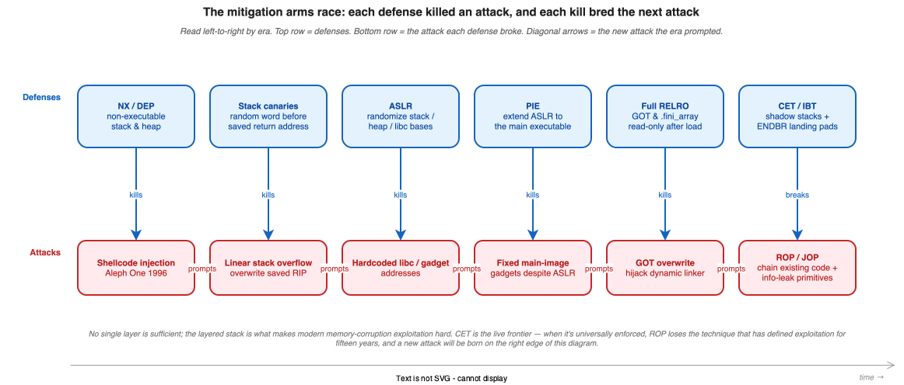
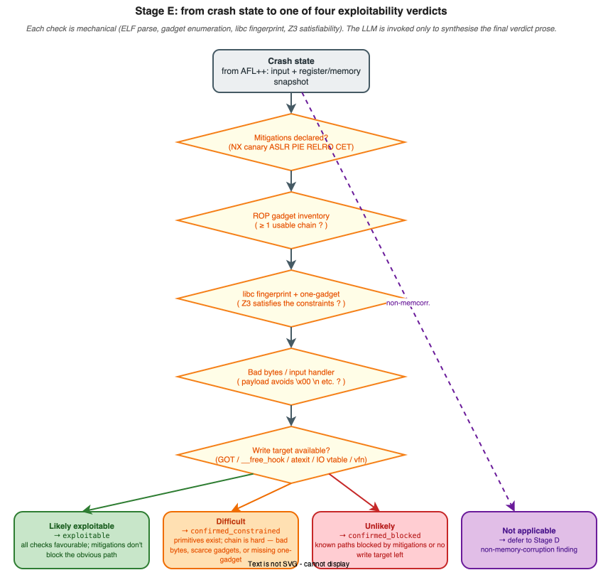

# Binary Exploit Feasibility: From Crash to Constraints

> Part 6 of 8. A crash is the start of the work. This post walks through what it takes to honestly answer "is this exploitable?"

---

Here is a thing I've watched happen more times than I'd like to admit. A team runs a fuzzer, AFL++ produces a crash, someone opens a ticket with the title "CRITICAL: SEGFAULT in binary X," attaches the crashing input, and sets the severity to HIGH. The ticket gets filed. Management gets briefed. Two weeks later, a proper exploit developer looks at it and says: "The heap allocator aborts before we can do anything useful. This isn't exploitable."

Two weeks of urgency, wasted. And the frustrating thing is that the opposite failure mode exists too: a crash that looks like a boring null deref but is actually a controllable write-what-where that gives you a shell in four steps.

If you've never written an exploit before, this post is your introduction to what separates those two cases. By the end, you'll have a working mental model of what makes memory corruption exploitable in modern systems — and understand exactly how RAPTOR automates the analysis that currently requires a senior exploit developer to do by hand.

---

## Series navigation

- Understanding AI-Native Security (Part 1): What this all actually means — and a vocabulary primer (done!)
- Understanding AI-Native Security (Part 2): Pattern Matching at Scale — Why a regex isn't enough (done!)
- Understanding AI-Native Security (Part 3): Dataflow Analysis — When pattern matching isn't enough (done!)
- Understanding AI-Native Security (Part 4): SMT Solvers and the Math of Killing False Positives (done!)
- Understanding AI-Native Security (Part 5): Fuzzing, and Where RAPTOR Enters the Story (done!)
- **📌 Understanding AI-Native Security (Part 6): Binary Exploit Feasibility — From crash to constraints (this blog post!)**
- Understanding AI-Native Security (Part 7): The LLM Validation Pipeline (coming soon!)
- Understanding AI-Native Security (Part 8): Putting It All Together — Honestly (coming soon!)

---

## In this post

- Why naive crash-to-severity pipelines fail in both directions, and what exploit feasibility analysis fixes
- The mitigation arms race: six generations of defenses, each a response to the attack that came before it
- Return-Oriented Programming (ROP): the technique that defined the last fifteen years of exploitation
- libc fingerprinting: why the glibc version on the target system can make or break an exploitation path
- One-gadgets: the lottery tickets of exploitation, and how Z3 checks whether they're usable
- Bad bytes: the constraint that ruins more exploits than anything else
- Write target availability under Full RELRO: what's left when the easy targets are blocked
- The four verdicts RAPTOR emits, and the honesty principle behind them
- For AI/ML engineers: why domain expertise belongs in tools, not prompts

---

## The naive pipeline vs. the honest one

A naive vulnerability-reporting pipeline says: "AFL++ found a crash, here's the input that triggers it. Severity: HIGH." Ship it.

This is wrong in both directions. Some of those crashes are trivially exploitable in any environment — the report should say so loudly. Others require a specific glibc version, a specific compiler version, a specific OS configuration, and won't reproduce in practice — the report should say *that* loudly too.

The difference between the two is the **exploit feasibility analysis**. It's the analysis that separates serious security research from alert-spamming. It's also exactly what experienced exploit developers do by hand, which is why automating it is one of the most valuable things RAPTOR does.

This post walks through what the analysis actually involves. If you've never written an exploit before, you'll come out the other end with a working mental model of what makes a memory corruption bug exploitable in modern systems.

---

## Mitigations: an evolutionary arms race

Modern operating systems and compilers ship with multiple layers of defense against memory corruption. None of them prevent bugs from existing; they just make turning a bug into reliable code execution dramatically harder.

Here's an analogy. Think of the history of bank robbing. Safe manufacturers built better safes; robbers got better drills. Banks added time locks; robbers started taking hostages. Banks added dye packs; robbers demanded unwrapped bills. Every defense prompted a new attack, and every attack prompted a new defense. Memory corruption exploitation works exactly the same way.

The single most useful way to understand the mitigations is **chronologically, as a sequence of responses to whatever the previous generation of attackers was doing**. Each mitigation exists because the previous attack worked too well. Each new attack technique exists because the previous mitigation worked too well. The arms race is what produced the current layered defense — and what continues to shape exploitation research today.

Here are the major mitigations in roughly the order they were introduced, with the attack they were responding to. I've found reading these chronologically is the single fastest way to understand why the attack surface looks the way it does today.

### NX / DEP — No-eXecute / Data Execution Prevention

**What attackers were doing**: writing shellcode (raw CPU instructions) into a buffer, then overflowing into the return address to jump to it. Aleph One's 1996 [*Smashing the Stack for Fun and Profit*](http://phrack.org/issues/49/14.html) made this technique universal knowledge.

**The defense**: mark the stack and heap as non-executable. If you write shellcode into a buffer and try to jump to it, the CPU faults. NX killed the classic "smash the stack and execute shellcode" technique that defined exploitation in the 1990s.

Almost every binary built in the last ~15 years has NX enabled. RAPTOR checks the ELF program headers for `GNU_STACK` permissions.

### Stack canaries (`-fstack-protector`)

**What attackers were doing**: linearly overflowing past a local buffer to corrupt the saved return address sitting a few bytes further up the stack.

**The defense**: insert a random value (the "canary") between local buffers and the saved return address. Before a function returns, check whether the canary still has its expected value. If a buffer overflow has overwritten the canary on its way to the return address, the check fails and the program aborts via `__stack_chk_fail`.

Canaries don't stop the bug; they stop the most common path from the bug to code execution. To bypass them you either need to leak the canary value (via an info-leak primitive elsewhere in the binary) or write to a target that doesn't sit behind a canary (heap data, function pointers in other regions, etc.).

RAPTOR detects canary presence via symbol checks (`__stack_chk_fail`, `__stack_chk_guard`) and from the binary's compiler flags when available.

### ASLR — Address Space Layout Randomization

**What attackers were doing**: hardcoding the addresses of libc functions or useful gadgets, knowing those addresses were the same on every machine running the same binary. Once you'd found `system`'s address once, the exploit worked everywhere.

**The defense**: the kernel randomizes the base addresses of the stack, the heap, mmap regions, and (with PIE — see below) the main executable itself, each time the program is loaded. An attacker who doesn't know where things live in memory can't reliably point execution at them.

ASLR is OS-level. For binaries that aren't position-independent, the main executable's code still loads at a fixed address; only stack/heap/libraries are randomized — which is why PIE became the next escalation.

### PIE — Position Independent Executable

**What attackers were doing**: even with ASLR on, the *main executable's* code stayed at fixed addresses on non-PIE binaries. Attackers used those fixed addresses as ROP gadgets.

**The defense**: a compile-time flag that makes the main executable itself relocatable, so ASLR applies to it too. With PIE, the attacker needs a memory disclosure (an info-leak primitive elsewhere in the binary) to learn where the code lives before they can use it.

### RELRO — RELocation Read-Only

**What attackers were doing**: overwriting entries in the **Global Offset Table (GOT)**, the table of function pointers the dynamic linker fills in for library calls. Overwrite the GOT entry for `printf` with the address of `system`, and the next `printf` call effectively becomes a `system` call. This was extraordinarily reliable because the GOT lives at a known offset from the binary base.

**The defense**: two flavors.

- **Partial RELRO** — most relocation data is marked read-only after the dynamic linker finishes, but the GOT is still writable.
- **Full RELRO** — the GOT is also read-only after startup. This blocks GOT-overwrite attacks entirely.

Full RELRO is increasingly the default on modern Linux distributions. It blocks GOT overwrites *and* `.fini_array` overwrites (a less-known sibling target). When Full RELRO is on, the attacker has to find writable function-pointer-like things elsewhere.

### CET / IBT / shadow stacks

**What attackers are still doing in 2026**: ROP, JOP (jump-oriented programming), and increasingly creative chains that bypass all the software-level mitigations above. Even with NX + canaries + ASLR + PIE + Full RELRO, exploitation is still possible if the attacker can find an info-leak primitive and has enough gadget variety.

**The defense**: on recent Intel and AMD processors, hardware-enforced [Control-flow Enforcement Technology](https://www.intel.com/content/www/us/en/developer/articles/technical/technical-look-control-flow-enforcement-technology.html) adds shadow stacks (a second protected stack of return addresses, checked against the regular stack) and indirect branch tracking (every `call`-target must start with an `ENDBR` instruction). Hardware-enforced, so the runtime cost is minimal. These are still rolling out and not universally enabled, but they're the next defensive frontier and they fundamentally break the ROP technique that's defined exploitation for the last fifteen years.

RAPTOR reports the full mitigation matrix for the target binary as part of Stage E.

Don't worry if this feels like a lot to hold in your head — the diagram makes it much cleaner.


*Figure 1 — The arms race read left-to-right by era. Top lane: defenses. Bottom lane: the attack each defense broke. The diagonal arrows are the historical engine of memory-corruption research — every kill bred the next attack. CET is the live frontier; when it's universally enforced, ROP loses the technique that has defined exploitation for fifteen years.*

---

## ROP gadgets: the technique born from NX

We've talked about the mitigations chronologically. Now, here's where it gets interesting. The single most important *attack* technique to understand — the one that defined exploitation for the last fifteen years — was born specifically as a response to NX.

If NX makes shellcode injection impossible and ASLR/PIE make jumping to known addresses impossible, what's left? **Return-Oriented Programming (ROP)** — invented because attackers needed a way to execute meaningful computation using *only code that was already in the binary*, since they couldn't inject their own anymore.

Think of it like this: you're a thief who can't bring your own tools into a building, but you're allowed to use the building's own equipment. ROP is the art of finding the building's tools and using them in an order their designers never intended.

The trick: most binaries contain millions of short instruction sequences ending in a `ret` instruction. By overwriting a saved return address on the stack with the address of one such sequence (a *gadget*), and stacking up more gadget addresses afterward, an attacker can chain together arbitrary computations using only code that's already in the binary. No injected code; just creative reuse of what's there.

A ROP chain that calls `system("/bin/sh")` typically looks like:

1. Gadget that pops a value into `rdi` (the first-argument register on x86-64)
2. Address of the string `"/bin/sh"` somewhere in memory
3. Address of `system` in libc

When the vulnerable function returns, it pops the first gadget's address and jumps to it. That gadget pops `"/bin/sh"` into `rdi`, then returns — which pops the next address from the stack, jumping to `system`. From `system`'s perspective, it was called normally with `rdi="/bin/sh"`. Shell.

The ROP chain only works if you can find the right gadgets in the binary you're targeting. ASLR/PIE complicate this: you need to know where the binary is loaded to know where the gadgets live. Full RELRO complicates further: you can't overwrite a function pointer to bootstrap.

**RAPTOR's ROP analysis** uses gadget-finding tooling to enumerate usable gadgets and grade their quality:

- Gadgets that do common operations (`pop rdi; ret`, `pop rsi; ret`, syscall gadgets)
- Gadgets free of bad bytes (null bytes, newlines — characters the input handler strips)
- Gadgets short enough to be reliable
- Stack-pivot gadgets (for when the attacker can move the stack pointer)

If the analysis reports **zero usable gadgets**, ROP is simply not on the table for this binary. That's a real result, not a tooling failure — it means the binary is small enough or stripped enough that there's nothing to chain.

---

## libc fingerprinting: the version matters

When a binary dynamically links libc (almost all of them do on Linux), exploitation often involves calling libc functions. But which libc? This is a question that surprises people outside the field: surely a standard library is a standard library? Not quite. Different glibc versions have:

- Different function offsets within the library
- Different one-gadgets (more on these below)
- Different security behavior — notably, [glibc 2.37+ filters `%n` in format strings](https://sourceware.org/glibc/wiki/FormatStringFiltering) when `_FORTIFY_SOURCE` is active, breaking many classic format-string write primitives
- Different heap allocator behavior (tcache layout, fastbin handling)

A naive analysis assumes "glibc has function X at offset Y." A real analysis fingerprints the actual library to know what's available. RAPTOR's exploit feasibility module does empirical verification: where it can, it runs targeted checks against the binary's library to confirm capabilities rather than relying on version strings (which can be misleading or stripped).

The most common case where this matters: format-string exploitation. The classic "use `%n` to write arbitrary values to arbitrary addresses" trick is blocked in fortified glibc builds. A report that says "format string vulnerability, write primitive available" might be flatly wrong if the target system runs a recent Ubuntu. RAPTOR checks before claiming.

---

## One-gadgets: the lottery tickets of exploitation

Here's a delightful corner of exploitation research. A *one-gadget* is a single address in libc that, when jumped to with certain register and memory state, gives you a shell. They exist because of how `execve("/bin/sh", ...)` is set up internally — there are a handful of points in libc where, if execution lands there with the right preconditions, you get `execve("/bin/sh", NULL, NULL)` for free.

The classic tool is [David942j's `one_gadget`](https://github.com/david942j/one_gadget), which scans a libc binary and lists every such address with its required constraints. Constraints look like:

```
constraints:
  [rsp+0x40] == NULL  // rsp+0x40 must point to a NULL value
```

Whether a one-gadget is usable depends on whether, at the moment your hijacked control flow lands there, those constraints happen to hold. Sometimes they do (lucky) and sometimes they don't.

This is where Z3 comes back in. RAPTOR's exploit feasibility module encodes the one-gadget constraints as an SMT problem against the captured crash state (registers, accessible stack memory). Z3 checks satisfiability:

- **SAT** → this one-gadget is reachable from this crash state; exploitation is plausible
- **UNSAT** → the constraints can't be met; this one-gadget won't work here

The output ends up in `exploitation_paths[vuln].one_gadget_info.smt_feasibility`. It's the most quantitative answer to "is this crash exploitable?" the framework can produce.

---

## Bad bytes: the constraint that ruins everything

I've saved this one for a dedicated section because it deserves it. Here's a constraint that destroys exploits more often than anything else: **the bytes you can write are restricted by the input handler**.

If the vulnerable function reads input via `strcpy`, your input can't contain a null byte (`\x00`) — `strcpy` stops there. On 64-bit Linux, most addresses contain null bytes (the upper bytes of a userspace address are usually zero). So if your write target is, say, `0x00007ffff7a0d260`, you can't write it through a strcpy-based primitive.

If the input handler reads via `fgets`, your input can't contain `\n`. If it reads from `scanf("%s")`, you can't include whitespace. Custom input parsers may strip even more characters.

RAPTOR's exploit feasibility module identifies the input handler and its bad-byte set, then checks whether the addresses needed for exploitation (ROP gadget addresses, libc function addresses, shellcode addresses) avoid those bytes. When they don't, the analysis reports the conflict — the bad bytes break this exploitation path, here's the alternative if there is one.

---

## Write target availability under Full RELRO

Earlier we noted that Full RELRO blocks GOT overwrites *and* `.fini_array` overwrites. So what's left? Quite a bit, actually — though none of it is as clean as a direct GOT overwrite.

- **`__free_hook`, `__malloc_hook`** — function pointers in libc that were intentional hook points. (Note: removed in glibc 2.34+. The framework detects this and adjusts.)
- **Function pointers in heap-allocated structs** — application-specific
- **VTables in C++ objects** — if the bug gives you a heap object whose vtable pointer you can overwrite
- **`exit` handlers** — `atexit`-registered callbacks live in writable memory; overwriting one and triggering `exit` redirects execution
- **`stdout`/`stderr` `_IO_FILE` vtables** — under some conditions, can be hijacked to call arbitrary functions during the next print

When Full RELRO is on, the framework looks for these alternatives and reports which ones are viable.

---

## The four verdicts

After running through all of the above — mitigations, gadgets, libc version, one-gadget satisfiability, bad bytes, write targets — Stage E emits one of four verdicts. This is where the mechanical checks translate into something a human can act on.

- **Likely exploitable** → `exploitable` in the final findings. The bug primitives exist, mitigations don't block them, the input handler doesn't constrain the necessary bytes.
- **Difficult** → `confirmed_constrained`. Primitives exist but exploitation is genuinely hard. Maybe a bypass is needed, maybe the ROP chain requires gadgets you don't quite have. Worth pursuing if motivated; not a click-and-pop.
- **Unlikely** → `confirmed_blocked`. Known exploitation paths are blocked by mitigations. The bug exists but isn't a practical threat in this environment. (Note: this is conditional on *known* paths. An exploit researcher with novel techniques might still find a way.)
- **Not applicable** → falls back to the Stage D ruling. Used for non-memory-corruption findings where Stage E doesn't apply.

Each verdict comes with a written explanation: what was checked, what blocks exploitation, what alternative targets exist, what would change the verdict (a newer libc, an environment with disabled mitigations, an info-leak primitive nearby).

The honesty principle: **report constraints accurately**. A `confirmed_blocked` finding is still a real bug — the report should explain that it's a real bug whose practical exploitation is currently blocked, not pretend it isn't a bug.


*Figure 2 — How the four verdicts are reached. Every check is mechanical (ELF parse, gadget enumeration, libc fingerprint, Z3 satisfiability); the LLM is invoked only to synthesise the final verdict prose. The `not applicable` path defers to the Stage D verdict for non-memory-corruption findings.*

---

## For the AI/ML engineers reading this

This post actually illustrates something important about how to structure a system that combines deterministic tools with LLMs — a question a lot of teams are getting wrong right now.

- **Domain expertise lives in tools, not prompts.** The knowledge "Full RELRO blocks .fini_array writes" is encoded in code that checks ELF headers, not in a prompt instructing the LLM to think about RELRO. Trying to push security-research knowledge into the LLM directly (via long prompts or fine-tuning) is slower, less reliable, and harder to update than putting it in deterministic code. When the glibc version changes and a new capability appears, you update one function in the tool; you don't retrain or reprompt.
- **The LLM's role is synthesis, not lookup.** Stage E gathers a structured set of findings (mitigations, gadget quality, libc version, bad bytes, write targets) and the LLM's job is to weigh them into a final verdict and write the explanation. The LLM does what it's good at (judgment + prose); the tools do what they're good at (mechanical checks). Don't flip this. An LLM asked to enumerate gadgets will hallucinate; a gadget-finding tool asked to explain exploitability will say nothing useful.
- **Be honest about uncertainty.** The four-verdict scheme is more honest than a binary exploitable / not-exploitable. Pipelines that flatten judgment into yes/no train operators to ignore the output; pipelines that report calibrated uncertainty get used.

---

## Next in series
*[Post 7 — The LLM Validation Pipeline](./07-llm-validation-pipeline.md). The eight-stage methodology that turns raw scanner output into verdicts you can stand behind.*

---

## Sources and further reading

- Shacham, ["The Geometry of Innocent Flesh on the Bone"](https://hovav.net/ucsd/dist/geometry.pdf) — CCS 2007. The paper that introduced return-oriented programming.
- Snow et al., ["Just-In-Time Code Reuse"](https://www.cs.unc.edu/~fabian/papers/oakland2013.pdf) — IEEE S&P 2013. Advanced ASLR bypass techniques.
- Marco-Gisbert & Ripoll-Ripoll, ["Address Space Layout Randomization Next Generation"](https://www.mdpi.com/2076-3417/9/14/2928) — Applied Sciences, 2019. A survey of ASLR weaknesses and bypass techniques.
- [checksec.sh](https://github.com/slimm609/checksec.sh) — the de-facto tool for inspecting ELF binary mitigations.
- [one_gadget](https://github.com/david942j/one_gadget) — finds one-shot RCE gadgets in libc.
