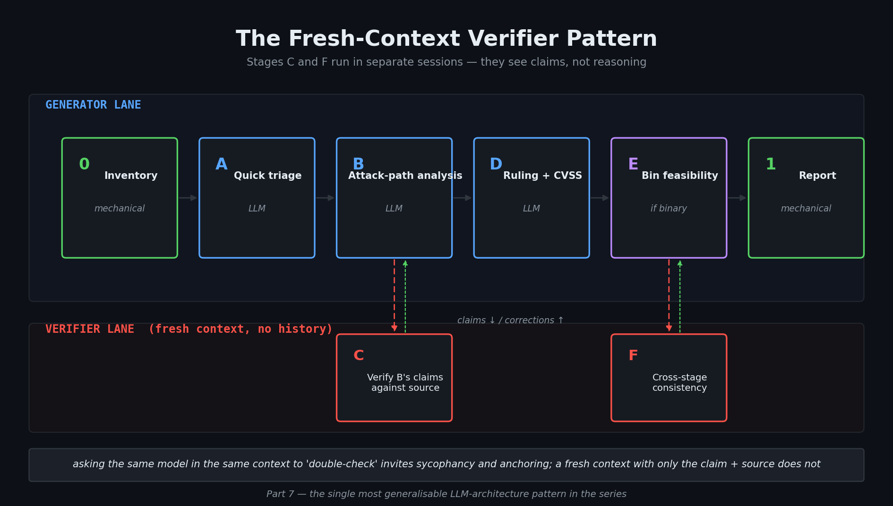

# The LLM Validation Pipeline: Why Fresh Context Is the Architectural Insight That Matters

> Part 7 of 8. The most generalisable post in the series for AI/ML engineers. If you read only one, read this one.

---

I want to start with something I notice whenever I watch teams hook LLMs up to security scanners for the first time.

They take the scanner output. They paste it into a prompt. They ask "is this exploitable?" And for the first few demos, it *looks* like it's working. The model produces confident, well-formatted answers. People nod. Someone says "this is incredible."

And then you look closely at the answers. And you realise the model is doing something much more like *pattern-matching against its training data* than actually reading and reasoning about the code in front of it. It's confidently wrong. Consistently. In characteristic ways.

The failures aren't random. They're architectural. And once you see the architecture that produces them, you can't un-see it.

---

## Series navigation

- Understanding AI-Native Security (Part 1): What this all actually means — and a vocabulary primer (done!)
- Understanding AI-Native Security (Part 2): Pattern Matching at Scale — Why a regex isn't enough (done!)
- Understanding AI-Native Security (Part 3): Dataflow Analysis — When pattern matching isn't enough (done!)
- Understanding AI-Native Security (Part 4): SMT Solvers and the Math of Killing False Positives (done!)
- Understanding AI-Native Security (Part 5): Fuzzing, and Where RAPTOR Enters the Story (done!)
- Understanding AI-Native Security (Part 6): Binary Exploit Feasibility — From crash to constraints (done!)
- **📌 Understanding AI-Native Security (Part 7): The LLM Validation Pipeline (this blog post!)**
- Understanding AI-Native Security (Part 8): Putting It All Together — Honestly (coming soon!)

---

## In this post

- The single architectural insight that fixes most LLM pipeline failures (the fresh-context verifier)
- Why "asking the model to double-check its work" is exactly the wrong solution
- All eight stages of RAPTOR's validation pipeline, and what each one does
- The multi-model strategies — consensus, judge, aggregate — and when each makes sense
- Six engineering patterns that generalise to any LLM system doing multi-step reasoning

---

## The architectural idea worth taking to your own systems

Before we get to security pipelines specifically, let me state the single most important AI-architectural pattern in this entire series — because it generalises far beyond security tooling, and most LLM systems get it wrong:

> **An LLM cannot reliably verify its own reasoning in the same context that produced it. The fix is to spawn a separate verification stage, with no access to the first stage's reasoning, that is given only the *claims* and asked to check them against ground truth.**


*Figure 1 — The pattern made concrete: the verifier lane is **physically separate** from the generator lane and shares none of its context. Stage C verifies individual claims from Stage B; Stage F verifies cross-stage consistency of the whole output bundle. Same architectural pattern, two granularities.*

That's it. That's the pattern. Once you internalise it, you start to see why so many LLM applications produce confidently wrong outputs even when you "ask the model to double-check its work" — because asking the same model in the same session is exactly *not* what verification means.

The mechanism: when an LLM has spent thousands of tokens building toward a conclusion, asking it to question that conclusion is asking it to fight its own context. It rarely wins. Sycophancy, anchoring, and consistency biases all push toward "yes, my prior reasoning was correct." The model in a *fresh* context, given only the claim and the source material, has no such pressure — it just reads the source and answers the question.

In code, the pattern looks like this:

```
generator_output = generator_model.run(prompt_with_full_context)
# Different session. Different context. Sometimes a different model.
verifier_output = verifier_model.run(
    "Here is a specific claim. Here is the source material. "
    "Is the claim accurate? Yes/no with citations."
)
```

The two stages do not share a conversation. The verifier sees only what it needs to verify, plus the ground truth. This is what the security literature would call a *blind review* and what cognitive scientists would call a *minimal-bias judgement*. The literature on self-correction in LLMs (notably [Madaan et al. 2023](https://arxiv.org/abs/2303.17651) on Self-Refine and the subsequent critical follow-ups) shows mixed results for in-context self-review; the fresh-context variant works much more reliably.

We'll spend the rest of this post seeing this pattern applied at multiple points in a real production pipeline. But hold the shape: **separate generators from verifiers, with fresh contexts**. If you take only one architectural idea from this series and use it in your own work, take that.

---

## Why "just ask the LLM" doesn't work for security

The naive AI-powered security pipeline is: run your scanners, take every finding, paste it into an LLM with the prompt "is this exploitable?", and ship whatever comes back.

This actually works *some* of the time. It also fails in characteristic ways:

- **The LLM confidently confirms findings that aren't real.** It pattern-matches the alert against patterns it saw in training data and produces a confident-sounding answer that's wrong.
- **The LLM dismisses findings that are real.** It sees a sanitiser call somewhere in the file and assumes it's protective, without checking whether the sanitiser is actually on the path to the sink.
- **The LLM contradicts itself across findings.** Two findings of the same CWE in the same codebase get rated wildly differently because each is analysed independently with no shared context.
- **The LLM hallucinates code.** It claims a function called `validateInput()` exists and provides a fix that calls it. The function does not exist.

The root problem behind all four failures is the same: **the LLM is doing too many things in one prompt**. It's being asked to verify the bug exists, trace its reachability, weigh exploitability, assign severity, and write a fix — all at once, in one shot, with no checkpoints.

The structural fix is **stage decomposition**: split the work into stages, each with a narrow job and a verifiable output, and gate each stage with checks (sometimes deterministic, sometimes a fresh-context LLM verifier) before passing forward.

RAPTOR's validation pipeline uses eight stages. Letters denote LLM stages; numbers denote mechanical ones. Let's walk all of them, and watch how often the fresh-context verifier pattern shows up.

---

## Stage 0 — Inventory (mechanical)

Before any LLM sees a finding, RAPTOR builds a structural inventory of the target:

- Extracts function signatures per language (Python `def`, JavaScript `function`/method, C function prototypes)
- Computes SHA-256 checksums of each source file for change detection
- Detects binaries that need Stage E feasibility analysis
- Optionally imports prior `/understand` output — attack surface maps, flow traces — as priors

The output is `checklist.json`, an explicit list of every finding that needs validation along with its file paths, CWE, and metadata.

The point of this stage is **groundedness**. Every later LLM stage has, as its source of truth, the structured inventory built here. If a Stage B claim references a function, the function has to appear in the inventory. If a Stage C verification needs a file checksum, it's there. The LLM never has to fall back to guessing what's in the codebase.

---

## Stage A — One-shot assessment (LLM)

The first human-like step: *is this finding even real?*

The LLM reads the relevant code (using the inventory to locate it), examines the alleged pattern, and makes an initial call: real vulnerability shape, or tool noise? It's not trying to prove exploitability yet — just answer the basic question of whether the pattern the scanner flagged actually exists in the code.

A surprising number of findings die here. Common cases:

- Scanner flagged a string concatenation as SQL injection, but the "concatenation" was inside a string literal in a comment
- Scanner flagged a hardcoded credential, but the file is a test fixture and the credential is a placeholder
- Scanner flagged a use of `eval`, but the function is never called and exists only as a deprecated stub

Stage A is fast and cheap. It's the equivalent of the senior engineer who scans the alert list and crosses off the obvious noise before anyone deep-dives.

---

## Stage B — Systematic attack path analysis (LLM)

Stage B is where serious work happens. The LLM doesn't just answer yes/no; it follows an explicit methodology:

1. **Identify entry points** — where does attacker-controlled input enter the system? (External HTTP, file uploads, env vars, IPC, etc.)
2. **Form hypotheses** — specific, testable predictions about how the vulnerability is reachable. "Hypothesis 1: an attacker can reach `parse_xml` via the public `/api/upload` endpoint by submitting a multipart form with content-type `application/xml`."
3. **Test each hypothesis against the actual code** — does the routing exist? Is there an auth gate? Is the content-type check strict?
4. **Track a proximity score (0–10)** — how close is this to genuinely exploitable? 0 = pattern exists but unreachable from any input; 10 = unauthenticated remote attacker can trigger it with a single request.
5. **Document disproven hypotheses** — equally important as confirmed ones. "Hypothesis 2: reachable via the `/admin/import` endpoint — DISPROVEN, that endpoint requires admin role enforced by middleware."

The working documents track all of this reasoning explicitly: attack surface maps, hypothesis lists, disproven paths. The proximity score is the key output. It distinguishes "this pattern exists" from "this is reachable and controllable."

This stage uses a methodology drawn from how expert security researchers actually work. They don't read code and pronounce; they hypothesise, test, score, and iterate. Stage B encodes that workflow.

---

## Stage C — Fresh-context sanity check (LLM)

**This is where the architectural pattern from the opening of this post shows up first.**

Stage C is the fact-checking stage. After Stage B has spent a long prompt building up a multi-step analysis, the LLM is given a *new, fresh prompt* with one job: **verify Stage B's claims against the actual source code**.

Critically, Stage C's prompt **does not include Stage B's reasoning**. It includes only Stage B's *claims*:

- "Stage B asserts that `validateUserInput` checks for SQL metacharacters. Read the function and confirm or refute."
- "Stage B asserts that the dataflow from `request.args.get('q')` to `cursor.execute(query)` has no sanitiser between them. Trace the path and confirm or refute."
- "Stage B asserts that the route `/api/upload` is publicly accessible with no auth middleware. Check the routing configuration and confirm or refute."

Each claim is checked by re-reading the source from scratch, with no prior context pulling the model toward "yes, my earlier reasoning was correct." The verifier has no earlier reasoning to defend.

This catches **analysis drift** — the failure mode where the LLM's reasoning gradually wandered away from what the code actually does. Stage B may have written "the `validateUserInput` function checks for SQL metacharacters" because that's a reasonable thing for such a function to do. Stage C goes and looks at `validateUserInput` and finds that it checks for `<script>` tags but not for SQL metacharacters. The Stage B claim is corrected, and the resulting verdict shifts.

The reason this works is that **the verifier is genuinely independent**. If you asked the same model in the same session "are you sure?", you'd get "yes" with high probability — that's the well-documented sycophancy failure mode. The fresh-context verifier has no relationship to the original reasoning; it just has the question and the source.

For AI/ML engineers building any system that produces structured claims about a body of source material — code review, document summarisation, research synthesis — this pattern transplants directly. The verifier doesn't need to be a more capable model; it just needs a fresh context and a narrow question.

---

## Stage D — Ruling and CVSS assignment (LLM)

The verdict stage. The LLM synthesises evidence from Stages A, B, and C and:

**Applies disqualifier checks (D-0 through D-4):**
- D-0: Is this code test-only? (Test infrastructure isn't shipped; not exploitable in production.)
- D-1: Is the input actually sanitised upstream?
- D-2: Are there defence-in-depth controls that block exploitation?
- D-3: Is the attack path truly reachable from an external attacker's perspective?
- D-4: Other disqualifier categories (compiler-optimised away, dead code by reachability, etc.)

**Assigns a CVSS 3.1 vector** — the full vector string, not just a 0–10 score. The vector captures attack vector (network / adjacent / local / physical), complexity, required privileges, user interaction, scope, and impact on confidentiality / integrity / availability. The score derives from the vector deterministically; recording the vector means downstream consumers can re-derive the score or extract individual axes.

**Issues a final verdict:** one of `exploitable`, `confirmed` (real but not currently exploitable), `confirmed_constrained`, `confirmed_blocked`, `ruled_out`, or `disproven`. Each comes with a written justification.

The reason for the rich verdict vocabulary: a binary "exploitable / not exploitable" loses too much information. `confirmed_constrained` says "the bug is real and somewhat exploitable, but you'll have to work for it" — exactly what an exploit developer needs to know to prioritise. `confirmed_blocked` says "real bug, but mitigations block known paths" — useful context for whether to patch urgently or defer.

---

## Stage E — Binary exploit feasibility (mechanical + LLM)

Only applies to memory corruption findings. Covered in detail in [Post 6](./06-binary-exploit-feasibility.md). In summary: checks mitigations (PIE, RELRO, NX, canaries), ROP gadget quality, libc fingerprint, one-gadget feasibility (via Z3), bad-byte constraints, and write target availability. Outputs a feasibility verdict that overrides Stage D's verdict if applicable.

---

## Stage F — Second fresh-context review (LLM)

**The architectural pattern returns.** Stage F is another fresh-context verifier, with a different focus. Stage C verified individual claims; Stage F looks for cross-stage *inconsistencies* in the final output bundle:

- Are there contradictions between stages? (Stage B said "reachable" but Stage D ruled `unreachable_path`?)
- Do CVSS vectors match the stated severity and impact? (A vector with `C:N/I:N/A:H` shouldn't be paired with a verdict that talks about data theft.)
- Are there low-confidence rulings that warrant a retry?
- Do verdict/severity/status fields agree with each other?

Like Stage C, Stage F sees the *outputs* of A through E but not their reasoning. So it isn't being asked to confirm the reasoning; it's being asked to spot inconsistencies in the outputs.

Corrections from Stage F propagate back into the findings before report generation. It's the framework catching its own errors rather than shipping them.

Two fresh-context verification stages bracketing the substantive analysis is not accidental. It's the architectural pattern from the start of this post, applied twice at different granularities: Stage C verifies *individual claims*; Stage F verifies *consistency across the whole output*.

---

## Stage 1 — Report generation (mechanical)

The mechanical final step. Merges all stage outputs into `validation-report.md` and canonical `findings.json`, generates coverage statistics, optionally renders Mermaid diagrams of the attack paths.

Nothing creative happens here. The hard work is done; this stage just formats it.

---

## Multi-model orchestration: cross-checking the reasoner

Single-model pipelines have a built-in failure mode: if the model is systematically wrong about some class of findings, you have no way to detect it. RAPTOR supports several strategies for cross-validation. Notice that each of them is, at its core, *another instance of the fresh-context verifier pattern* — just with a different model in the verifier role.

### Consensus mode (`--consensus`)

A second, different model performs **blind re-analysis** of each finding. "Blind" means it doesn't see the primary model's verdict — it analyses the finding from scratch with the same Stage A–D prompts. A majority vote decides the final ruling. When models disagree, the conflict is flagged for human review.

The point of blindness: if the second model sees the first's analysis, it tends to anchor on it. Blind re-analysis produces genuinely independent samples.

### Judge mode (`--judge`)

A judge model sees the primary analysis and critiques it **non-blindly**. It looks for missed attack paths, flawed logic, and inconsistencies. This is less about catching factual errors (Stages C/F do that) and more about challenging the reasoning quality — would another expert agree with how this was prioritised?

### Multi-model mode (`--model`, repeatable)

You pass `--model A --model B --model C` and each model independently analyses every finding. Results are correlated into an agreement matrix:

- **All three agree** → highest confidence
- **Two of three agree** → majority verdict with the disagreement logged
- **All three disagree** → flagged for human review

This is the most expensive mode (3× cost minimum) and the most defensible.

### Aggregation mode (`--aggregate`)

With three or more models, an aggregation model synthesises the results into a narrative: top findings, disputed findings, recommended next actions. This is summary on top of the multi-model verdicts, useful for operators who want a brief.

---

## Reliability scorecards

Over many runs, RAPTOR accumulates per-model reliability data — broken down by vulnerability class. The `/scorecard` command answers questions like "which model is most reliable at SQL injection findings?" or "where does model X tend to overconfidently confirm false positives?"

This matters because models genuinely have different strengths. A model that's great at C memory corruption might be mediocre at web-framework-specific authorisation bugs. Without scorecards you'd never know; with them you can route specific finding classes to specific models.

---

## For the AI/ML engineers: the design patterns to take with you

Several patterns from this pipeline generalise beyond security tooling. If you're building any LLM application that does multi-step reasoning, these are worth internalising:

### 1. The fresh-context verifier (the headline)

We've said this several times already, but here it is one more time because it's the one to remember: **spawn a separate verification stage with no access to the generator's reasoning, and ask it to check specific claims against ground truth**. Use this for fact-checking, consistency-checking, and any place where you'd otherwise be tempted to "have the model double-check its work" in the same context. It's the single highest-ROI architectural pattern in this post.

### 2. Stage decomposition over end-to-end prompting

Long prompts that ask the LLM to do everything in one call have worse calibration, more contradictions, and more hallucination than the same work split across stages with explicit handoffs. The marginal cost is some plumbing; the benefit is dramatically better outputs.

### 3. Deterministic gates between probabilistic stages

Stage 0, Stage 1, the SARIF merge layer, the SMT pre-filter — these are all deterministic checkpoints between LLM stages. They normalise, dedupe, ground-truth, and gate. Without them the LLM stages would compound each other's errors. With them, errors are caught and corrected at the boundaries.

### 4. Calibrated verdicts over binary outputs

The six-verdict vocabulary (`exploitable`, `confirmed`, `confirmed_constrained`, `confirmed_blocked`, `ruled_out`, `disproven`) preserves information that a binary classifier would destroy. Operators can prioritise differently based on the verdict. Downstream automation can decide differently. This is a small design choice with big downstream consequences.

### 5. Cost tracking with budget cutoffs

Real-time dollar-amount tracking with a graceful budget cutoff. When you exceed budget, you stop and report partial results — you don't silently truncate. Most "agentic" demos handwave this away. Production pipelines can't.

### 6. Multi-model cross-validation with explicit failure modes

Consensus, judge, multi-model, aggregation — each corresponds to a different epistemic strategy for handling uncertainty. They're not interchangeable; each makes sense in different contexts. Building these modes explicitly (rather than just "ask the model twice and average") forces you to confront what kind of uncertainty you're trying to mitigate.

---

## Next in series

- [Post 8 — Putting It All Together (Honestly)](./08-agentic-workflow-and-examples.md). The full pipeline walked through with real examples — and a candid section on the limitations these tools still don't solve.

## Sources and further reading
- *Wei et al., ["Chain-of-Thought Prompting Elicits Reasoning"](https://arxiv.org/abs/2201.11903) — NeurIPS 2022. The paper that popularised stage-based reasoning prompting; the empirical foundation for why "think step by step" works.*
- *Madaan et al., ["Self-Refine: Iterative Refinement with Self-Feedback"](https://arxiv.org/abs/2303.17651) — NeurIPS 2023. Worth reading alongside this post because it documents the limits of in-context self-review (and is exactly why Stage C uses a fresh context instead of asking the same model to verify itself).*
- *Huang et al., ["Large Language Models Cannot Self-Correct Reasoning Yet"](https://arxiv.org/abs/2310.01798) — ICLR 2024. The strongest empirical case for why same-context self-correction doesn't work, and indirectly why the fresh-context pattern is the right architectural response.*
- *[Anthropic's Building Effective Agents](https://www.anthropic.com/engineering/building-effective-agents) — practical guidance on multi-step LLM systems, including when to prefer workflows (like this pipeline) over fully autonomous agents.*
