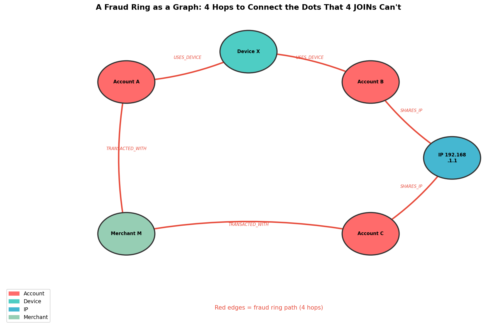
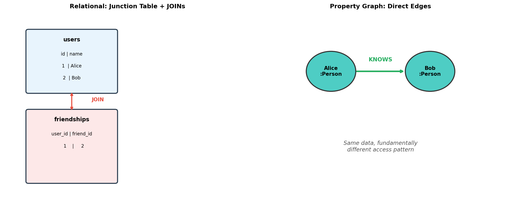
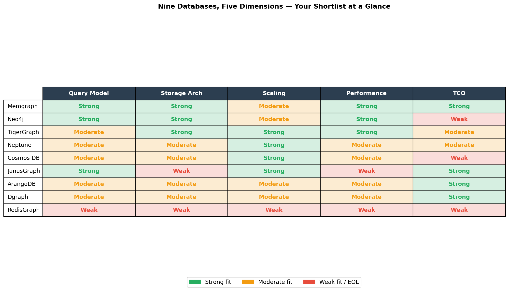

# So You Need a Graph Database — Let's Figure Out Which One Won't Waste Your Quarter

*Part 1 of 5 — Series: Graph Databases: From Zero to Production*
*Last verified: May 2026*

---

This week I went deep into graph databases. Not because I wanted to — because a team I advise hit the wall. Their SQL fraud-detection queries were timing out, their joins were stacking 5 levels deep, and nobody could simplify them anymore.

And sure, I could jump straight into "here's how to pick one." But given how many teams I've seen burn a full quarter on the wrong choice — data already loaded, queries already written, stakeholders already frustrated — I thought it would be worth taking a step back first.

Before you can pick the right graph database, you need to understand *why* they exist, *where* they actually win, and *how* to evaluate them on dimensions that matter (not just marketing benchmarks).

In this blog post — the first in a 5-part series — I'm giving you the full landscape map.

We'll walk through why graph databases are a fundamentally different beast, what real-world problems pushed them into existence, and a decision framework you can use right now to shortlist tools. By the end, choosing a graph database will feel less like a gamble and more like an informed bet.

Ready? Let's jump in 🚀

---

## Blog Series

📌 **Part 1: So You Need a Graph Database — The Landscape** *(this post!)*
[Part 2: Graph Database Internals: How Storage Engines Decide Your Performance Ceiling](part-2-engine.md)
[Part 3: Graph Query Languages Compared: Cypher vs Gremlin vs GSQL vs DQL](part-3-languages.md)
[Part 4: Graph Databases in Production: What Breaks, Why It Breaks, and How to Contain It](part-4-the-catch.md)
[Part 5: Running Graph Databases in Production: Optimization, Pitfalls, and the Go-Live Playbook](part-5-surviving-production.md)

---

## What We'll Cover

- Why graph databases are a fundamentally different beast — not just "a database with joins"
- The real-world problems that made graph DBs necessary (with actual production numbers)
- The one architectural idea that makes graphs different: index-free adjacency
- A tour of 9 graph databases — the honest version, not the marketing version
- The 5 (+1) dimensions that actually matter when evaluating
- A decision framework you can use right now

---

## TL;DR (for the impatient)

- Graph databases win when the answer lives in the **relationships**, not just the records.
- Evaluate on five dimensions: **query model, storage architecture, scaling model, performance profile, and TCO**.
- Pick based on your dominant workload: **real-time OLTP, billion-edge analytics, cloud-native ops, or cost-constrained self-hosting**.

> **Why this matters:** A poor graph DB choice doesn't fail on day one. It fails after your data and query complexity have already locked you in. That's the expensive kind of failure.

Don't worry — by the end of this post, you'll have a framework that makes this choice much less scary.

---

## Why Graphs Exist — Real Problems, Not Theory

Graph databases didn't appear because someone thought SQL joins were ugly. They appeared because real production systems were *breaking* under the weight of relationship-heavy data.

Here's what that looks like in practice. And trust me, once you see these examples, you'll understand why I got obsessed with this topic.

**Fraud detection.** A bank wants to find fraud rings — groups of accounts that share devices, IP addresses, and merchants in suspicious patterns. The relational query to find "account A → shared device → account B → shared IP → account C → transacted with merchant D" requires four or more JOINs across tables with hundreds of millions of rows. Each JOIN is an index lookup. Four JOINs means four index lookups, chained. The query planner basically gives up long before you find your fraud ring.

A graph traversal? It follows the same path in four pointer hops. The database doesn't scan a billion rows. It follows a wire. That's it.

**GraphRAG for AI.** Traditional vector search retrieves semantically similar content — it finds "documents that feel like this query." But enterprise questions are structural: "show me all drugs that interact with proteins associated with Alzheimer's markers." That's a multi-hop reasoning problem. Vector alone can't answer it — the structure *is* the answer. Microsoft's [GraphRAG research](https://www.microsoft.com/en-us/research/blog/graphrag-unlocking-llm-discovery-on-narrative-private-data/) reported large gains over vector-only RAG on enterprise corpora — substantially higher accuracy on holistic and multi-hop questions. We dig into the actual numbers in Part 3.

**Recommendation engines.** Netflix's recommendation system connects actors, movies, genres, viewing history, and semantic concepts in a knowledge graph. Netflix's own engineers ([Gomez-Uribe & Hunt, 2015](https://dl.acm.org/doi/10.1145/2843948)) put the value of the personalization system at *over $1 billion per year* in reduced churn — and that estimate is more than a decade old now. LinkedIn uses social graph traversal for connection recommendations — "you know Alice, Alice knows Bob, Bob works at the company you're interviewing at." Elegant, right?

**Supply chain visibility.** A manufacturer needs to know: if this factory in Taiwan shuts down today, which of my product lines are affected? With SQL, that's a chain of self-JOINs across a supplier hierarchy. At tier 3 suppliers, the query becomes unmaintainable. At tier 5, it doesn't run. A graph traversal follows the supply chain naturally — one hop per tier, regardless of depth.

**Cybersecurity threat analysis.** When a credential is compromised, the question is: "what can an attacker reach from here?" That's a shortest-path problem on a graph. Traditional SIEM tools log events but don't answer structural questions about what's *reachable*. A graph does.

*A fraud ring as a graph: 4 hops to connect the dots that 4 JOINs can't.*

---

## The One Thing That Makes Graphs Different

Before we get into which database to pick, you need to understand the single architectural idea that separates graph databases from everything else. Because it's not just "better at joins." It's a fundamentally different way to store data.

Let me use an analogy that made it click for me.

In a relational database, relationships live in junction tables. Want to know who Alice knows? You query the `friendships` table, JOIN to `users`, and filter. Every hop is a new index lookup. The cost grows as your data grows.

Think of it like a **phonebook**. Looking up "Alice" in a phonebook of ten million people takes the same logarithmic lookup time whether Alice has one friend or a thousand. The index doesn't know anything about Alice's relationships — it just knows where Alice is.

Now here's the graph way.

A native graph database stores relationships as direct pointers. Alice's node record contains a pointer to her first relationship. That relationship record contains a pointer to the next one. Every hop follows a wire — a literal memory address or file offset. No index. No scan.

This is called **index-free adjacency**. Think of it like a **rolodex**. Alice's card has Bob's card clipped to the back of it. Bob's card has Carol's card clipped to the back of his. To find Alice's network, you flip cards — you don't search the entire deck.

The result? A 5-hop traversal on a 10-billion-node graph costs the same as on a 10-million-node graph, *if the local neighbourhood size is the same*. The cost is proportional to the local neighbourhood, not the total graph size.

This is why graph databases win for relationship-heavy queries. And this is what you're paying for when you give up the familiar comfort of SQL.

*Same data, fundamentally different access pattern.*

---

## The 5 (+1) Dimensions That Actually Matter

Now, here's where most teams go wrong. They get distracted by benchmarks and marketing pages that all claim "high performance at scale." (I mean, who *doesn't* claim that?)

Let me give you the five dimensions that actually determine whether a database fits your workload. These are the knobs that matter.

**1. Query model.** What language does the database use? Is it declarative (you describe *what* you want, the optimizer decides *how*) or imperative (you describe how to traverse)? Does it support openCypher? Can you express multi-hop patterns naturally?

**2. Storage architecture.** Is adjacency stored natively (pointer-based, O(1) per hop) or non-natively (index-based, O(log n) per hop)? Is the graph in memory, on disk, or hybrid? How does MVCC work? You'll understand the full implications in Part 2.

**3. Scaling model.** Horizontal (partition across machines) or vertical (buy a bigger server)? What happens when your graph doesn't fit? Does the database support read replicas?

**4. Performance profile.** Optimized for OLTP (fast individual traversals) or OLAP (high-throughput analytics across the whole graph)? A database that's fast for one is often slow for the other.

**5. Total cost of ownership.** License cost is the visible part. The invisible part: infrastructure (RAM is expensive), operational overhead (managing three distributed systems vs. one managed service), and switching cost.

**6. Graph algorithms library.** If your workload includes PageRank, community detection, centrality, or shortest-path-at-scale, the *quality of the built-in algorithms library* matters more than raw query speed. Neo4j ships GDS (50+ production-grade algorithms). TigerGraph has an open algorithms library with MPP execution. Memgraph has MAGE. If you'll write your own BFS in Cypher, this dimension barely matters; if you won't, it's decisive.

*Nine databases, five dimensions — your shortlist is where green aligns with what matters most to you.*

---

## The 9 Databases — The Honest Version

Here's the part I wish someone had written when I started evaluating. No marketing. One "best for" and one "known weakness" per database. Ready?

**Memgraph.** Property graph, Cypher-compatible, in-memory by default. Designed for real-time streaming graph workloads — fraud detection pipelines, live recommendation updates. Sub-millisecond traversal latency on a single powerful server. *Best for: real-time OLTP where latency is everything. Known weakness: RAM ceiling. Extremely fast until your graph doesn't fit in memory.*

**Neo4j.** The most mature graph database. Labeled property graph, Cypher, strong enterprise ecosystem (GDS, APOC, migration tooling). Runs on the JVM. *Best for: enterprise production deployments where you need vendor support, a rich ecosystem, and proven operational tooling. Known weakness: Enterprise licensing is expensive (think $30–50K+ per-4-cores range). No transparent horizontal sharding — Composite databases let you federate queries across multiple DBs, but that's not automatic per-query partitioning.*

**TigerGraph.** Massively parallel property graph with GSQL (native language). Distributes multi-hop analytics across a cluster using Bulk Synchronous Parallel execution. Built-in PageRank, centrality, community detection. *Best for: billion-edge graphs needing analytics and OLTP together. Known weakness: GSQL is not an easy hire. Vendor lock-in is significant.*

**Amazon Neptune.** Managed multi-model on AWS. Supports Gremlin, SPARQL, and (partially) openCypher. Zero storage management. *Best for: AWS-native teams who want zero operational overhead and can accept AWS lock-in. Known weakness: Cypher support is second-class.*

**Azure Cosmos DB (Gremlin API).** Globally distributed, multi-master, Gremlin-based. Data stored as JSON documents under the hood. *Best for: Azure-native teams needing multi-region graph writes. Known weakness: RU/s billing is opaque for graph workloads — a 5-hop traversal consumes wildly different RUs than a point lookup, and it's hard to predict costs.*

**JanusGraph.** Open-source, TinkerPop/Gremlin-based. Pluggable backends — typically Cassandra + Elasticsearch. Free. *Best for: cost-sensitive teams with existing Cassandra infrastructure. Known weakness: you're operating three distributed systems simultaneously. The operational complexity is real.*

**ArangoDB.** Multi-model — documents, key-values, and graphs in one system with AQL. ACID transactions. *Best for: teams needing both document storage and graph traversal in one query. Known weakness: not MPP. Large-scale graph analytics hit single-machine limits.*

**Dgraph.** Native property graph with GraphQL+ (DQL). Schema = API schema. *Best for: GraphQL-first teams. Known weakness: smaller community, fewer enterprise integrations.*

**RedisGraph.** EOL January 2025. Don't start new projects on it. If you're running it, plan your migration now.

---

## The Decision Framework

Four questions. Answer them honestly and your shortlist writes itself.

**1. What's your write pattern?**
Heavy writes to high-degree nodes? Be cautious with Neo4j — every new edge splices into the doubly-linked relationship chain on both endpoints, so concurrent writes to a single high-degree node serialize. Append-only edge streams (Kafka ingestion)? Memgraph or TigerGraph.

**2. How big will your graph actually get?**
Under 100M nodes on a powerful server? Memgraph handles this in memory with room to spare. Hundreds of billions of edges? TigerGraph's MPP was built for this. Genuinely uncertain and growing? Neo4j or Neptune — both have paths to larger deployments.

**3. Do you need OLAP alongside OLTP?**
Need real-time traversals *and* batch analytics in the same system? TigerGraph, or Neo4j + GDS on a dedicated analytics instance. OLTP only? Memgraph or Neo4j are simpler choices.

**4. What's your real operational budget?**
Zero ops team, already on AWS? Neptune. Already on Azure? Cosmos. Have a team, cost-sensitive? JanusGraph or self-hosted Neo4j Community. Need sub-millisecond at scale with 256GB RAM? Memgraph.

**A fifth question for architects migrating from relational data:** Are you bringing existing relational data? Factor in the transformation cost. Graph data modeling requires *query-driven redesign* — not a schema projection where tables become nodes and foreign keys become relationships. That approach produces a graph that performs worse than what you already have. Proper migration design easily doubles the initial timeline. Plan for it.

---

## Closing Thought

Graph databases are not a silver bullet. They're a **topology advantage** when your product depends on multi-hop reasoning.

If this post helped you shortlist tools, great. But here's the thing — picking a database by feature list without understanding storage internals is the biggest architecture mistake I see. And that's exactly what Part 2 is about.

Don't worry, we'll break it down step by step. No scary internals magic — just bytes, pointers, and analogies. 🚀

*[Next up: Graph Database Internals: How Storage Engines Decide Your Performance Ceiling →](part-2-engine.md)*
