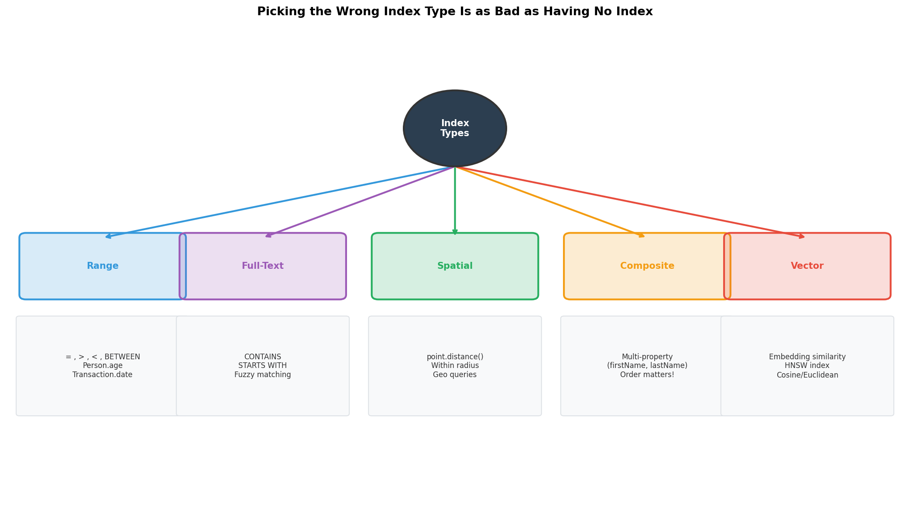
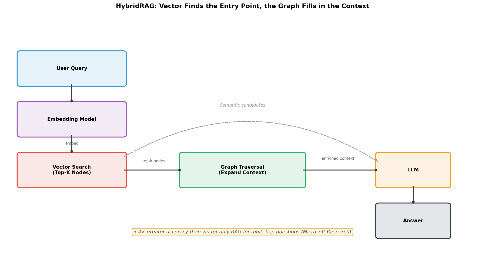

# Graph Query Languages Compared: Cypher vs Gremlin vs GSQL vs DQL

*Part 3 of 5 — Series: Graph Databases: From Zero to Production*
*Last verified: May 2026*

---

In Part 2, we opened up the engine — bytes, pointers, linked lists, the works. You now know what happens on disk (or in RAM) when you write and read graph data.

But here's what I didn't expect when I first started building graph systems: the query language you pick matters *almost as much* as the database itself. And most teams treat it as a syntax preference. It isn't.

Your query language controls who owns performance decisions: **you** or **the optimizer**. That single choice impacts hiring, maintainability, and runtime behavior for years.

In this post, we're putting all four major graph query languages side by side. Same query, four completely different mental models. By the end, you'll know exactly which language fits your team — and more importantly, *why*.

Let's jump in 🚀

---

## Blog Series

[Part 1: So You Need a Graph Database — The Landscape](part-1-landscape.md)
[Part 2: Graph Database Internals: How Storage Engines Decide Your Performance Ceiling](part-2-engine.md)
📌 **Part 3: Graph Query Languages Compared: Cypher vs Gremlin vs GSQL vs DQL** *(this post!)*
[Part 4: Graph Databases in Production: What Breaks, Why It Breaks, and How to Contain It](part-4-the-catch.md)
[Part 5: Running Graph Databases in Production: Optimization, Pitfalls, and the Go-Live Playbook](part-5-surviving-production.md)

---

## What We'll Cover

- Cypher (declarative), Gremlin (imperative), GSQL (procedural), and DQL/GraphQL (API-first)
- The same traversal written in all four — what each reveals about its optimizer
- How Cypher's cost-based planner actually works (this is high-ROI knowledge)
- How to read EXPLAIN and PROFILE output
- Index types: range, full-text, spatial, composite, and vector
- Vector + Graph: the architecture everyone is building right now
- When to use which language — the decision most blog posts skip

---

## TL;DR (for the impatient)

- **Cypher** is planner-driven and great for productivity — but vendor extensions reduce portability.
- **Gremlin** gives you explicit traversal control — but performance responsibility shifts entirely to you.
- **GSQL** unlocks distributed analytics; **DQL/GraphQL** favors API-first teams.
- HybridRAG is becoming standard: vector search for recall, graph traversal for structure.

> **Key insight:** Language choice is an *architecture* choice, not a developer-preference choice. Choose accordingly.

---

## The Four Languages and What They Assume

### Cypher — Declarative Pattern Matching

Cypher is the SQL of graph databases. You describe the *shape* of what you want, and the query planner decides how to find it.

```cypher
MATCH (alice:Person {name: 'Alice'})-[:FRIEND]->(friend:Person)
RETURN friend.name
```

Notice what you *didn't* say. You didn't say "start at Alice, follow the FRIEND relationships, collect the endpoints." You described a pattern — a shape in the graph — and the planner decided where to start, which direction to traverse, and how to use indexes. That's the power of declarative: you reason about *what*, not *how*.

The openCypher standard is supported by Neo4j, Memgraph, and Amazon Neptune (partially). Queries written against one can often run on another. *Often* — but not always. More on that below.

### Gremlin — Imperative Traversal

Gremlin is the opposite philosophy. You write step-by-step. Every step is an explicit traversal decision.

```groovy
g.V().has('name', 'Alice')
 .out('FRIEND')
 .values('name')
```

The order of steps is the order of execution. There is no global optimizer rewriting your query. The upside: predictability — you know *exactly* what the database will do. The downside: performance responsibility is entirely on you. If you order steps badly, nobody saves you.

Gremlin is supported by JanusGraph, Amazon Neptune, Azure Cosmos DB (Gremlin API), and Amazon MemoryDB. It's the most widely supported graph query language across different databases.

### GSQL — Procedural + Declarative Hybrid

GSQL is TigerGraph's native language. It combines SQL-style `SELECT ... FROM pattern` clauses with explicit *accumulators* — typed, parallel-safe aggregation variables updated as the traversal fans out across the cluster:

```gsql
SumAccum<INT> @@reachable;
Start = {alice};
Hop1 = SELECT t FROM Start:s-(FRIEND:e)->Person:t
       ACCUM @@reachable += 1;
```

The `ACCUM` keyword collects results in parallel across TigerGraph's MPP partitions using Bulk Synchronous Parallel execution. GSQL has a very high analytical ceiling — PageRank, centrality, community detection, all natively. The learning curve is steep and the hiring market is thin. It pays off at billion-edge scale. (Full friends-of-friends query below.)

### DQL/GraphQL (Dgraph)

Dgraph's query language builds on GraphQL conventions. Your database schema *is* your API schema:

```graphql
{
  queryPerson(filter: {name: {eq: "Alice"}}) {
    friends {
      friends @filter(not(someOf: Alice.friends)) {
        name
      }
    }
  }
}
```

Familiar to frontend developers. The tree-shaped response model works well for hierarchical data. It struggles with cycles — a genuine limitation when your data has bidirectional or circular relationships.

---

## openCypher Compatibility — What You Actually Need to Know

Cypher is standardized as openCypher. Neo4j, Memgraph, and Neptune all support it. Basic traversals are portable.

But here's the catch (there's always a catch, right?).

Neo4j has APOC (`apoc.refactor.*`, `apoc.path.*`) and GDS (`gds.pageRank.*`). These don't exist in Memgraph — Memgraph has MAGE with equivalent functions but different syntax. A query like this works in Neo4j but fails in Memgraph:

```cypher
CALL apoc.path.spanningTree(startNode, {relationshipFilter: 'KNOWS>'})
YIELD path RETURN path
```

The rule: if portability matters, keep queries within the openCypher standard and document which features use vendor extensions. It's not hard — but you need to be intentional about it.

---

## The Same Query in Four Languages

Use case: find all friends-of-friends of Alice, excluding people Alice already knows directly.

Same data. Same question. Four completely different mental models.

**Cypher (Neo4j / Memgraph)** — the planner decides the starting point and traversal order:

```cypher
MATCH (alice:Person {name: 'Alice'})-[:FRIEND]->(friend)-[:FRIEND]->(fof)
WHERE NOT (alice)-[:FRIEND]->(fof) AND fof <> alice
RETURN DISTINCT fof.name
```

**Gremlin (JanusGraph / Neptune / Cosmos)** — you decide every step:

```groovy
g.V().has('Person', 'name', 'Alice')
 .aggregate('direct')
   .out('FRIEND')
 .out('FRIEND')
 .where(without('direct'))
 .where(neq('Alice'))
 .values('name').dedup()
```

Note: `aggregate('direct')` stores first-level friends in a side-effect collection before traversing to level two. You're managing state manually. If that feels like extra work... it is.

**GSQL (TigerGraph)** — declarative pattern + parallel accumulator:

```gsql
CREATE QUERY friends_of_friends(VERTEX<Person> alice) FOR GRAPH SocialGraph {
  SetAccum<VERTEX<Person>> @@direct_friends, @@fof;
  Start = {alice};
  Direct = SELECT t FROM Start:s-(FRIEND:e)->Person:t
           ACCUM @@direct_friends += t;
  FOF = SELECT t FROM Direct:s-(FRIEND:e)->Person:t
        WHERE t NOT IN @@direct_friends AND t != alice
        ACCUM @@fof += t;
  PRINT @@fof;
}
```

**DQL/GraphQL (Dgraph):**

```graphql
{
  queryPerson(filter: {name: {eq: "Alice"}}) {
    friends {
      friends @filter(not(someOf: Alice.friends)) {
        name
      }
    }
  }
}
```

See the difference? The Cypher version lets the planner optimize. The Gremlin version requires you to manage the exclusion set manually. The GSQL version computes in parallel. The DQL version looks clean but requires understanding how `someOf` filters interact with the tree response model.

---

## How the Cypher Planner Actually Works

Understanding the Cypher optimizer is one of the highest-ROI things you can do as a developer working with Neo4j or Memgraph. Let me walk you through what it does before executing your query.

**Step 1: Estimate cardinality for each clause.** How many nodes/edges will each pattern match? The planner uses stored statistics — node counts per label, relationship counts per type. If `Person` has 10 million nodes but `Person {country: 'US'}` has 2 million (with an index on `country`), the planner knows starting from the index gives a 5× smaller initial set.

**Step 2: Select the starting anchor.** The planner picks the clause with the smallest estimated cardinality as the entry point. If you write `MATCH (a)-[:KNOWS]->(b:Person {country:'US'})`, the planner may start from `b` (indexed by country) and traverse *backwards* to `a`, even though you wrote `a` first. You wrote a pattern, not an execution order. The planner doesn't care about your left-to-right reading preference.

**Step 3: Decide traversal direction.** Cypher can traverse any relationship in either direction regardless of how it was physically created. The planner picks the direction that hits fewer intermediate nodes first.

### EXPLAIN vs. PROFILE — Your Two Best Friends

These are the two most valuable debugging commands in Cypher. I use them constantly.

```cypher
EXPLAIN MATCH (p:Person {country: 'US'})-[:KNOWS]->(q) RETURN q.name
```

`EXPLAIN` shows the execution plan the planner *intends* to use. Zero query execution — safe to run in production. It shows the operator tree: what index gets used, which node is the anchor, what direction the traversal goes.

```cypher
PROFILE MATCH (p:Person {country: 'US'})-[:KNOWS]->(q) RETURN q.name
```

`PROFILE` executes the query *and* shows how many rows were actually produced at each step, compared to the planner's estimate. The most important number: if the planner estimated 100 rows but 2 million were produced at an intermediate step, your cardinality statistics are stale or your query is poorly anchored.

The most important warning sign: **`NodeByLabelScan`** in the plan output. This means the database is scanning all nodes with a given label — no index. If you see this on a large label like `Person` or `Transaction`, stop everything and create an index before deploying.

---

## Index Types — Picking the Right Tool

Graph databases support more index types than most developers use. And picking the wrong type is as bad as having no index at all.

**Range index (default).** For equality and range queries on scalar properties. `Person.age`, `Transaction.date`. O(log n) lookup.

```cypher
CREATE INDEX person_age FOR (p:Person) ON (p.age)
```

**Full-text index.** For substring and fuzzy text search. When you need `CONTAINS`, `STARTS WITH`, or Lucene-style tokenized matching. Backed by Lucene in Neo4j; Elasticsearch in JanusGraph.

```cypher
CREATE FULLTEXT INDEX productSearch FOR (p:Product) ON EACH [p.description]
CALL db.index.fulltext.queryNodes('productSearch', 'wireless headphones') YIELD node, score
```

**Spatial (point) index.** For geographic queries. "Find all restaurants within 2km." Neo4j supports 2D and 3D point types with built-in spatial functions.

```cypher
CREATE POINT INDEX location_coords FOR (l:Location) ON (l.coordinates)
MATCH (l:Location) WHERE point.distance(l.coordinates, point({latitude: 48.8566, longitude: 2.3522})) < 2000
```

**Composite index.** Multiple properties together. `Person(firstName, lastName)`. Accelerates queries filtering on `firstName` alone, or both together. Does NOT accelerate `lastName` alone. Order by descending selectivity (most selective first).

```cypher
CREATE INDEX person_name FOR (p:Person) ON (p.firstName, p.lastName)
```

**Vector index (HNSW).** For semantic similarity search using ML embeddings. This is new and big. **Neo4j:** vector indexes backed by Apache Lucene HNSW, native `VECTOR` type rolled out across 2025.x releases ([Neo4j vector indexes](https://neo4j.com/docs/cypher-manual/current/indexes/semantic-indexes/vector-indexes/)). **Memgraph:** vector search powered by [USearch](https://github.com/unum-cloud/usearch), fully supported since [Memgraph v3.2](https://memgraph.com/docs/release-notes).

```cypher
-- Neo4j 2025
CREATE VECTOR INDEX productEmbeddings FOR (p:Product) ON (p.embedding)
OPTIONS {indexConfig: {`vector.dimensions`: 1536, `vector.similarity_function`: 'cosine'}}
```


*Picking the wrong index type is as bad as having no index.*

---

## Vector + Graph — The Architecture Everyone Is Building Right Now

Vector databases and graph databases used to be separate tools for separate problems. In 2025, the line is dissolving. And for good reason.

### Why Vector Alone Isn't Enough

Vector search finds semantically similar items. Ask "who wrote papers about attention mechanisms?" and you get papers with embeddings close to your query. Good recall for single-concept retrieval.

But try this: "who co-authored papers with people who have worked at Anthropic, where the paper is specifically about graph neural networks?"

That's a multi-hop structural question. The answer isn't in any single document's embedding. The answer is in the *relationships* between documents, authors, and institutions. Vector alone can't answer it. The structure is the answer.

Microsoft's GraphRAG team measured this concretely. On their published benchmarks ([Microsoft Research, GraphRAG](https://www.microsoft.com/en-us/research/blog/graphrag-unlocking-llm-discovery-on-narrative-private-data/)), GraphRAG delivers roughly **3.4× higher accuracy than vector-only RAG on enterprise evaluations**, with a separately measured **+27.23-point improvement on multi-hop questions** versus vanilla RAG. The takeaway either way: when the answer requires connecting multiple facts that are individually retrievable but contextually linked, structure beats raw semantic similarity.

### The HybridRAG Pattern

Here's the architecture that's becoming standard:

1. **User query → embedding** → vector search → retrieve top-k semantically similar nodes
2. **For each retrieved node → graph traversal** → expand context via relationships (co-authors, citations, related concepts)
3. **Both semantic candidates AND their graph context → LLM** as the final reasoning step

The vector search finds the entry point. The graph traversal fills in the context that makes the LLM's answer accurate and structured. It's elegant when you see it in action.

**What this looks like in the wild:**
- **Biomedical knowledge graphs (e.g. [AlzKB](https://alzkb.ai/)):** vector similarity over paper abstracts + graph traversal over drug → protein → pathway → disease relationships.
- **Legal/contract research:** vector search over case text for semantic recall, then graph traversal over the citation network for context.
- **E-commerce:** vector search interprets "rechargeable electric toothbrush" semantically; graph traversal surfaces compatible replacement heads and frequently-bought-together accessories.

### Neo4j 2025: Semantic Search + Graph in One Query

```cypher
-- Find products similar to the query, then find related products via category graph
CALL db.index.vector.queryNodes('product-embeddings', 5, $queryEmbedding)
YIELD node AS product, score
MATCH (product)-[:BELONGS_TO]->(category)<-[:BELONGS_TO]-(related)
WHERE related <> product
RETURN product.name, related.name, score
ORDER BY score DESC
```

The first two lines use the vector index. The MATCH clause uses the graph. One query, one round trip. Pretty powerful, right?


*HybridRAG: vector finds the entry point, the graph fills in the context.*

---

## When to Use Which Language

This is the decision most blog posts skip. So here it is directly:

| If you are... | Use |
|---|---|
| Building on Neo4j or Memgraph | **Cypher** — native language, best planner support, rich ecosystem |
| Building on TigerGraph with analytics requirements | **GSQL** — the only way to unlock Bulk Synchronous Parallel execution |
| Building on JanusGraph, Neptune, or Cosmos | **Gremlin** — TinkerPop is the native API for all three |
| Building a GraphQL-first API with Dgraph | **DQL/GraphQL** |
| Uncertain and want maximum portability | **Cypher/openCypher** — widest cross-database support |
| OLTP only, 2–3 hops, portability matters | Either Gremlin or Cypher — both work; Gremlin runs on more databases |

The deepest trap: choosing Gremlin because it runs on more databases, then discovering that Gremlin traversal performance depends entirely on what optimizer (if any) the database uses. On Neptune, Gremlin goes through Neptune's planner. On JanusGraph, you're responsible for every step-ordering decision. The portability is real; the *performance portability* is not.

---

## Closing

You now have the language map and the optimizer mental model. That puts you ahead of most teams I've seen start a graph project. Seriously — understanding how your planner works is one of those things that pays compound interest forever.

Next, we move from "how to build" to "what breaks under load" — the part most vendor material avoids. Supernodes, cross-partition penalties, ACID semantics that mean different things in different databases. The fun stuff. 🚀

*[Next: Graph Databases in Production: What Breaks, Why It Breaks, and How to Contain It →](part-4-the-catch.md)*
