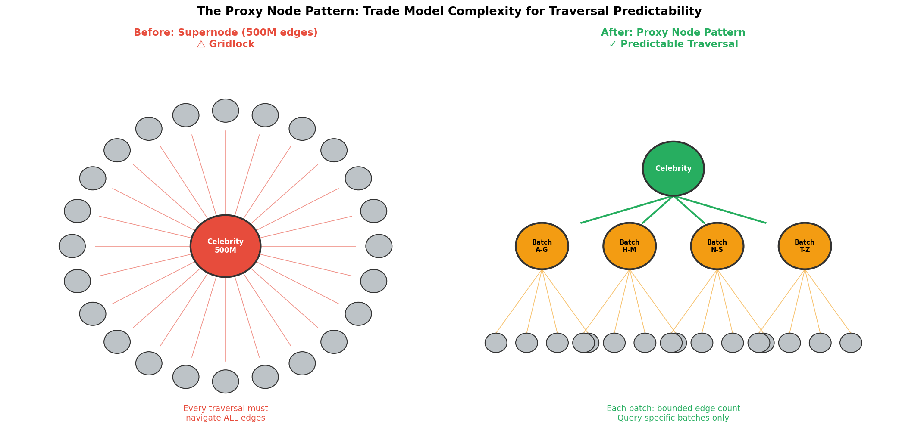
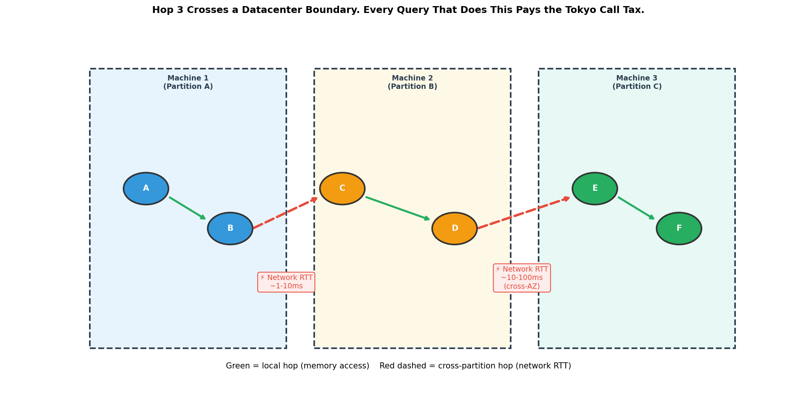
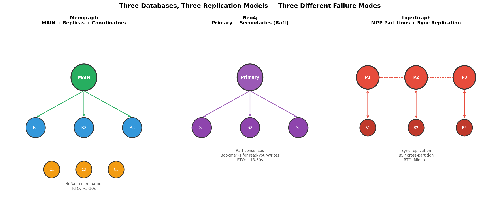

# Graph Databases in Production: What Breaks, Why It Breaks, and How to Contain It

*Part 4 of 5 — Series: Graph Databases: From Zero to Production*
*Last verified: May 2026*

---

Parts 1–3 were about choosing, understanding, and querying. This one is about what your on-call rotation will actually be paged for.

And honestly? This is the post I wish existed when I was building my first production graph system. Because demos show 20 nodes and millisecond queries. Production gives you 100M nodes, billions of edges, and hotspot topology that punishes optimistic architecture.

The breakpoints are predictable. Supernodes, cross-partition hops, "ACID" that means five different things depending on who you ask, and writes that quietly amplify 10×. None of this is random. It's all structural — and therefore preventable, if you know where to look.

Let's walk through what actually breaks, why it breaks, and how to contain it before it wakes you up at 3am. 🚀

---

## Blog Series

[Part 1: So You Need a Graph Database — The Landscape](part-1-landscape.md)
[Part 2: Graph Database Internals: How Storage Engines Decide Your Performance Ceiling](part-2-engine.md)
[Part 3: Graph Query Languages Compared: Cypher vs Gremlin vs GSQL vs DQL](part-3-languages.md)
📌 **Part 4: Graph Databases in Production: What Breaks, Why It Breaks, and How to Contain It** *(this post!)*
[Part 5: Running Graph Databases in Production: Optimization, Pitfalls, and the Go-Live Playbook](part-5-surviving-production.md)

---

## What We'll Cover

- The Supernode Problem: what happens when one node has 500 million edges
- When Edges Cross Machines: the distributed traversal penalty
- The ACID Trap: what "ACID" actually means at a partition boundary
- Storage and Transactions: WAL, MVCC, and crash recovery
- Scaling and HA: replication modes, leader election, RTO per database
- Write amplification in distributed graphs

---

## TL;DR (for the impatient)

- Topology, not just query syntax, drives large-scale failure modes.
- Supernodes and cross-partition hops are the predictable performance killers.
- "ACID support" is not uniform — transaction scope differs sharply by engine.
- Distributed safety features (WAL, replication, locks) raise write cost by design.

> **The bottom line:** Most graph incidents are NOT random. They are model- and topology-induced, and therefore preventable. That's the good news.

---

## The Supernode Problem

Let me tell you about a team I worked with. They ran fraud detection on a graph with about 80M accounts. For six months, p99 query latency sat comfortably at 40ms. Life was good.

Then a holiday weekend pushed a single payment processor node — the merchant account that handles a popular gift card brand — past 12 million inbound `TRANSACTED_WITH` edges in a single week. Overnight, *every* traversal that crossed that node went from 40ms to "still running 90 seconds later."

The graph didn't grow. *One node* grew.

That node has a name. It's called a **supernode** — a node whose degree is several orders of magnitude higher than the median. And here's the thing: they are NOT edge cases. They appear in every domain that has a graph and a power law: popular products in e-commerce, hub airports in flight networks, shared accounts in finance, celebrities in social, the `Country: 'US'` node in any analyst's first naive schema.

Think of it like Times Square: a single intersection that every path tries to cross. Quiet at 2am. Gridlocked at 5pm.

**What goes wrong, and why.** The pain has three independent sources, and which one bites you depends on your engine:

- **Read iteration cost (Neo4j).** Neo4j threads every relationship of a node onto a doubly-linked list. Reads follow that list selectively — a `MATCH (popular)<-[:PURCHASED]-(buyer)` skips edges of other types as it walks. But it still *walks*. A node with 500M edges has a 17GB relationship-chain footprint (500M × 34 bytes), and any traversal that doesn't aggressively filter is iterating against that chain.

- **Write contention (Neo4j).** Worse on the write side: every new edge has to splice into the doubly-linked relationship chain on *both* endpoints. Concurrent writes to a single high-degree node **serialize on its relationship-chain pointers**. There is no way to thread 1,000 simultaneous inserts onto the same linked list in parallel. Physics, not tuning.

- **Wide-row deserialization (JanusGraph).** JanusGraph stores a node's entire adjacency as one Cassandra wide row. To read *one* edge from a 500M-edge node, Cassandra deserializes the whole row. This isn't a slow-query problem — it's an availability problem. A handful of supernodes can pin a Cassandra node into GC pause hell.

- **The MPP exception (TigerGraph).** TigerGraph's degree-aware partitioning explicitly splits a high-degree node's edge list across machines. No single machine owns all 500M edges. This is one of the genuinely structural reasons to pay TigerGraph's price.

### What Breaks First

In order of pain:

1. **BFS frontier expansion.** At a high-degree node, the frontier for the next traversal level explodes. 1 node × 500M neighbors = 500M nodes to visit at depth 2. Graph databases use lazy streaming iterators — but the logical work still grows. Your query times out.

2. **Wildcard relationship patterns.** `MATCH (n)-[]->(m)` on a high-degree node traverses *every* edge — all types, all directions. On 500M edges, this is never the right query. Always filter: `MATCH (n)-[:PURCHASED]->(m)`.

3. **Aggregations without WHERE.** `MATCH (p:Product)<-[:PURCHASED]-(u) RETURN count(u)` on a popular product loads every edge. No index can help a bare count traversal. Add a filter or pre-aggregate.

### 5 Concrete Mitigations

**1. The Proxy Node Pattern.** Replace the supernode with a hierarchy:

```
(Celebrity)-[:HAS_FOLLOWER_BATCH {range: 'A-M'}]->(FollowerBatch)
                  -[:INCLUDES]->(Follower)
```

Trade query complexity for traversal predictability. Any single FollowerBatch has millions of edges, not hundreds of millions.

**2. Relationship type filtering at storage.** Never use bare `-[]->` on a node with unknown degree. Filter by relationship type at every traversal. This is a storage-level filter — the database skips non-matching types without loading their endpoints.

**3. Time-based edge partitioning.** For temporal supernodes, introduce time-range bucket nodes:

```
(Product)-[:PURCHASE_ACTIVITY {year: 2024, quarter: 'Q1'}]->(ActivityBucket)
                -[:PURCHASED_IN]->(Customer)
```

Cap edge count per bucket by design. Don't traverse all history when you only need this quarter.

**4. Degree-aware query routing at application layer.** Before issuing a traversal to a known high-degree node, check its degree programmatically. If `degree > threshold`, serve from a pre-aggregated cache rather than live traversal. Don't wait until the query times out to discover you hit a supernode.

**5. TigerGraph degree-aware partitioning.** If your domain guarantees supernodes (social graphs, product catalogs, financial hubs), design for them upfront. TigerGraph's MPP distributes the edge list across partition machines. Structural choice, not tuning choice.


*The proxy node pattern: trade model complexity for traversal predictability.*

---

## When Edges Cross Machines

Here's an analogy that made this click for me: imagine making a phone call from Tokyo to New York every time you need to traverse one hop in a query.

That's distributed graph traversal. When your graph is sharded across machines, every hop that crosses a partition boundary pays a network round-trip. Intra-datacenter RTT: 1–10ms. Cross-AZ RTT: 10–100ms.

A 5-hop traversal that crosses 3 partition boundaries: 3 × 10ms = 30ms of network latency *added* to your query, regardless of how fast the database itself is. Physics.

Different databases handle this differently:

**TigerGraph (Bulk Synchronous Parallel).** Multi-hop traversals execute in synchronized rounds. All hops at depth N complete before any hop at depth N+1 starts. Cross-partition communication is batched per BSP round. Right architecture for analytical multi-hop queries at scale.

**JanusGraph (Sequential inter-node calls).** Each cross-partition hop is a sequential Cassandra read. A 5-hop traversal = up to 5 sequential cross-partition reads. No batching, no parallelism. This is the architectural reason JanusGraph struggles with deep traversals in large graphs.

**Memgraph (No sharding).** The entire graph lives on one machine. No cross-partition traversal because there are no partitions. Every hop is a local memory access. The trade-off: when the graph outgrows a single machine's RAM, you need a different architecture. But until that point, Memgraph's traversal latency is fundamentally better than any sharded system.


*Hop 3 crosses a datacenter boundary. Every query that does this pays the Tokyo call tax.*

---

## The ACID Trap

"ACID" appears on every graph database marketing page. And I'll be honest — this is where I got burned early. "ACID" does not mean the same thing across databases. The isolation level determines what concurrent readers see. The transaction scope determines whether "atomic" means one node, one partition, or the whole cluster.

Here's what ACID *actually* looks like per database — including what each row means for code you'll write:

| Database | Isolation Level | Cross-Partition TX | Write Conflict Behavior | What this means for your code |
|---|---|---|---|---|
| Memgraph | Snapshot Isolation (MVCC) | N/A — no sharding | Conflicting writes: one aborts | Wrap hot-node writes in retry logic |
| Neo4j | Read-Committed (default) | N/A — no sharding | Write locks serialized | Long reads may see different values mid-transaction |
| TigerGraph | Serializable (cluster-wide) | Yes — sync replication | Full serializability; conflict = lock wait | Safest semantics, but write latency = cross-replica RTT |
| Neptune | Snapshot Isolation (MVCC) | N/A — single multi-AZ volume | Optimistic; conflict = abort | Same retry discipline as Memgraph |
| JanusGraph (Cassandra) | Read-Committed at row level | No cross-shard TX | Last-write-wins per row | Cross-partition updates need external coordinator (saga) |
| ArangoDB | ACID per document/shard | Cross-shard TX in Enterprise | Conflict at document level | Cross-shard TX = Enterprise-only feature |

The questions to ask before signing:
- Is isolation Snapshot or Read-Committed?
- If I write to nodes on two different shards, is that atomic? (JanusGraph: **no**.)
- What happens when two transactions write to the same node? (Memgraph: one aborts. Neo4j: one waits. TigerGraph: serialized.)

These are not implementation details. They're constraints on what your application can safely assume.

> ⚠️ **Security implication worth calling out:** Misunderstood transaction scope can create inconsistent authorization or fraud-state reads across partitions. If your fraud-detection graph reads from JanusGraph across shards without external coordination, you might get a "clean" read on one shard while a related write on another shard hasn't committed yet. That's not a performance bug — it's a data integrity gap.

---

## Storage and Transactions Deep Dive

### WAL and Crash Recovery

Every production database must answer: "What happens if the server loses power mid-write?"

**Memgraph:** WAL + periodic binary snapshots. On crash, replay WAL from last snapshot checkpoint. Recovery time: proportional to WAL entries since last snapshot. Configure `--storage-snapshot-interval-sec` to bound the window.

**Neo4j:** Page cache WAL. Every change written to WAL before page cache update. Crash = replay from checkpoint. Neo4j's checkpoint is continuous. On a warm page cache (~95%+ hit ratio), reads almost never touch disk.

**TigerGraph:** Checkpoint-based persistence with non-blocking background checkpoints. For large clusters with billions of edges, checkpoint completion time can be minutes.

**JanusGraph:** Stateless. No WAL — all durability delegated to Cassandra or HBase. If JanusGraph crashes, restart it — it has no state to recover.

### Crash Recovery and Failover RTO

| Database | Failover Mechanism | RTO Estimate |
|---|---|---|
| Memgraph | NuRaft leader election (3 coordinators) | ~3–10 seconds |
| Neo4j | Raft election (Primary/Secondary 5.x) | ~15–30 seconds |
| TigerGraph | Automatic failover to replica | Minutes for large clusters |
| Neptune | Managed AWS promotion | < 30 seconds (AWS SLA) |
| JanusGraph | Stateless restart; Cassandra handles data | Near-instant restart |


*Three databases, three replication models — three different failure modes.*

### Replication Modes and Read-Your-Writes

**Memgraph replication** offers three consistency levels:
- `ASYNC`: Fastest. Risk: failover could lose recent commits.
- `SYNC`: Write waits for one replica ack. Safe for most workloads.
- `STRICT_SYNC`: Write waits for *all* replicas. Slowest. Zero data loss guaranteed.

Check lag: `SHOW REPLICATION LAG`. Growing lag = a replica that gets promoted will be missing data. Configure `max_failover_replica_lag` to prevent stale-replica promotion.

**Neo4j** uses bookmarks for read-your-writes. After a write, the driver receives a bookmark (logical clock value). Next read carries the bookmark and waits for the replica to reach that clock value. Guarantees users see their own writes immediately.

---

## Concurrency and Query Timeouts

Here's something the demo never shows: every query in a graph database can potentially run *forever*. An unbounded traversal on a large graph is not a slow query — it's an infinite one.

Set query timeouts before you go to production. Not as an afterthought. *Before*.

**Neo4j:** `db.transaction.timeout` in `neo4j.conf`. Default: no timeout. A reasonable OLTP starting point: 30 seconds.

**Memgraph:** `--query-execution-timeout-sec`. Default: 600 seconds (10 minutes!). For OLTP, set to 10–30 seconds. Long queries in OLTP are usually bugs, not features.

**TigerGraph:** Query-level timeout in GSQL or via `GSQL-TIMEOUT` REST header. Set at the API layer.

**Connection pooling:** Use the official driver's built-in pool. Never create a new driver instance per request. Under high concurrency (>100 simultaneous queries), tune `maxConnectionPoolSize` to match your thread pool.

---

## Write Amplification in Distributed Graphs

Write amplification is the ratio of physical bytes written to logical bytes requested. In a distributed graph database, it's always greater than 1. Often *much* greater.

Here's why one logical write (create one edge) becomes many physical writes:

1. **WAL write:** Minimum 2× amplification — one WAL entry + one data entry.
2. **Relationship pointer updates (Neo4j):** One edge = 4 pointer updates across 2 node records.
3. **Index updates:** A composite index on `(name, age, country)` = 3 index entries per insertion.
4. **Replication:** STRICT_SYNC in Memgraph = minimum 3× (primary + 2 replicas).

The fundamental trade-off is the **RUM conjecture**: you cannot simultaneously minimize **R**ead amplification, **W**rite amplification, and Space (**M**emory) amplification. Pick two.

- B+tree indexes (Neo4j default): optimize reads, amplify writes.
- LSM-tree storage (RocksDB — Memgraph's on-disk mode): optimize writes, amplify reads.
- In-memory (Memgraph default): minimizes both at the cost of RAM.

**Who this affects most:** TigerGraph (MPP + synchronous replication = high write amplification by design), Neo4j with many secondary indexes (each index multiplies write cost), and JanusGraph on Cassandra (LSM = lower write amplification but higher read amplification for non-cached reads). Know which trade-off you're making.

---

## Closing

You now know where graph systems crack first. And more importantly — these failures are structural, not random. They're predictable. They're preventable.

The final step is turning that awareness into repeatable production discipline: query controls, observability, schema evolution, and go-live readiness. That's what Part 5 is all about — the operating manual.

Don't worry, it's practical: checklists, mitigations, and the exact metrics to watch. No theory. Just the stuff that keeps you off the pager at 3am. 🚀

*[Next: Running Graph Databases in Production: Optimization, Pitfalls, and the Go-Live Playbook →](part-5-surviving-production.md)*
